# 📖 Guía teórica — Entregable AyVD Parte 1

> Todos los conceptos estadísticos y metodológicos necesarios para resolver
> los Ejercicios 1 y 2 del entregable, explicados en profundidad.

---

## Índice

1. [Fundamentos previos](#1-fundamentos-previos)
   - 1.1 Variable aleatoria
   - 1.2 Tipos de variables
   - 1.3 Distribución de probabilidad
   - 1.4 Población vs muestra
2. [Estadística descriptiva univariada](#2-estadística-descriptiva-univariada)
   - 2.1 Medidas de centralización
   - 2.2 Medidas de dispersión
   - 2.3 Cuantiles y percentiles
   - 2.4 Asimetría y curtosis
3. [Visualización de una variable](#3-visualización-de-una-variable)
   - 3.1 Histograma
   - 3.2 Boxplot (diagrama de caja)
   - 3.3 Violin plot
   - 3.4 Gráfico de barras (variables categóricas)
   - 3.5 KDE (Kernel Density Estimation)
4. [Limpieza y preparación de datos](#4-limpieza-y-preparación-de-datos)
   - 4.1 Valores faltantes (NaN) — incluye NaN con significado semántico
   - 4.2 Detección de outliers — incluye IQR estratificado por subpoblación
   - 4.3 Selección de sub-población
   - 4.4 Justificación de decisiones
5. [Ejercicio 1: Análisis descriptivo comparativo](#5-ejercicio-1-análisis-descriptivo-comparativo)
   - 5.1 Comparación de distribuciones
   - 5.2 Comparación de medidas descriptivas
   - 5.3 Comparación de probabilidades
   - 5.4 Variables confusoras y sesgo
6. [Estadística descriptiva bivariada](#6-estadística-descriptiva-bivariada)
   - 6.1 Covarianza
   - 6.2 Coeficiente de correlación de Pearson
   - 6.3 Coeficiente de correlación de Spearman
   - 6.4 Matriz de correlación
   - 6.5 Columnas derivadas para evaluar redundancia
7. [Densidad de probabilidad](#7-densidad-de-probabilidad)
   - 7.1 Densidad marginal
   - 7.2 Densidad conjunta
   - 7.3 Densidad condicional
   - 7.4 Independencia estadística
8. [Visualización multivariada](#8-visualización-multivariada)
   - 8.1 Scatterplot (diagrama de dispersión)
   - 8.2 Scatterplot con hue (variable categórica)
   - 8.3 Pairplot (matriz de dispersión)
   - 8.4 Heatmap de correlación
   - 8.5 Boxplot facetado
9. [Formulación de hipótesis y abordaje](#9-formulación-de-hipótesis-y-abordaje)
   - 9.1 Pregunta de investigación
   - 9.2 Hipótesis
   - 9.3 Diseño del abordaje analítico

---

## 1. Fundamentos previos

### 1.1 Variable aleatoria

Una **variable aleatoria** (v.a.) es una función que asigna un valor numérico a cada resultado de un experimento aleatorio. En nuestro contexto, cada columna del dataset es una variable aleatoria y cada fila es una **realización** (un valor observado) de esas variables.

**Ejemplo concreto:** La columna `salary_monthly_NETO` es una variable aleatoria. Cada fila contiene un valor concreto (una realización): $2.400.000, $3.500.000, etc. No sabemos de antemano qué salario tendrá la próxima persona que responda la encuesta, pero podemos estudiar el patrón de los valores observados.

**Notación:** Se usa una letra mayúscula para la variable (X) y minúscula para un valor observado (x). Así, X = "salario neto" y x = 2.400.000.

### 1.2 Tipos de variables

| Tipo | Subtipo | Descripción | Ejemplo en el dataset |
|------|---------|-------------|----------------------|
| **Numérica** | Continua | Puede tomar cualquier valor en un intervalo | `salary_monthly_NETO` (2.400.000,5) |
| **Numérica** | Discreta | Toma valores enteros o contables | `profile_age` (25, 30, 45) |
| **Categórica** | Nominal | Categorías sin orden inherente | `profile_gender` (Hombre Cis, Mujer Cis) |
| **Categórica** | Ordinal | Categorías con orden natural | `work_seniority` (Junior < Semi-Senior < Senior) |

**¿Por qué importa esta distinción?** Porque determina qué medidas y visualizaciones son apropiadas:
- Variables numéricas → media, mediana, histograma, scatterplot
- Variables categóricas → moda, frecuencias, gráfico de barras, tablas de contingencia
- No tiene sentido calcular la "media" de `profile_gender`

### 1.3 Distribución de probabilidad

La **distribución** de una variable describe con qué frecuencia (o probabilidad) se presentan sus posibles valores. Es el "mapa completo" del comportamiento de la variable.

**Distribución empírica:** Es la que observamos directamente en los datos. Si 500 de 5000 encuestados ganan entre $2M y $3M, la frecuencia relativa de ese rango es 500/5000 = 10%.

**Distribución teórica:** Es un modelo matemático que aproxima la distribución empírica (ej: distribución normal, exponencial). En este entregable trabajamos principalmente con distribuciones empíricas.

**Visualizar la distribución** es el primer paso para entender cualquier variable: ¿los valores se concentran en un rango? ¿Hay valores atípicos? ¿Es simétrica o sesgada?

### 1.4 Población vs muestra

| Concepto | Definición | En nuestro caso |
|----------|-----------|-----------------|
| **Población** | Conjunto completo de individuos de interés | Todos los trabajadores de IT en Argentina |
| **Muestra** | Subconjunto de la población que observamos | Los 4.939 que respondieron la encuesta Sysarmy |
| **Parámetro** | Valor verdadero de la población (desconocido) | El salario promedio real de todos los IT |
| **Estadístico** | Valor calculado sobre la muestra (conocido) | El salario promedio de los 4.939 encuestados |

**Sesgo de selección:** La encuesta Sysarmy es voluntaria y difundida por redes sociales. Esto introduce un sesgo: no representa a todos los trabajadores de IT (ej: quienes no usan redes o no conocen Sysarmy no participan). Esto es importante mencionarlo en el informe.

---

## 2. Estadística descriptiva univariada

"Univariada" = analizamos **una sola variable** a la vez.

### 2.1 Medidas de centralización

Buscan responder: **¿cuál es el valor "típico" o "central"?**

#### Media aritmética (promedio)

$$\bar{x} = \frac{1}{n} \sum_{i=1}^{n} x_i$$

- Suma todos los valores y divide por la cantidad.
- **Ventaja:** usa toda la información disponible.
- **Desventaja:** es **muy sensible a outliers**. Si 99 personas ganan $2M y una gana $600M, la media se dispara a $8M, que no representa a nadie.
- **Cuándo usarla:** cuando la distribución es aproximadamente simétrica y sin outliers extremos.

**En Python:** `df['salary_monthly_NETO'].mean()`

#### Mediana

- Es el valor que divide los datos ordenados en dos mitades iguales (50% por arriba, 50% por abajo).
- Si n es impar: es el valor central. Si n es par: promedio de los dos centrales.
- **Ventaja:** es **robusta a outliers**. Con la misma situación anterior, la mediana sigue siendo ~$2M.
- **Desventaja:** no usa toda la información (solo la posición).
- **Cuándo usarla:** cuando hay outliers o distribuciones asimétricas (como salarios, que típicamente tienen asimetría positiva).

**En Python:** `df['salary_monthly_NETO'].median()`

#### Moda

- Es el valor que más se repite.
- Para variables continuas se usa sobre datos agrupados (rangos).
- **Uso principal:** variables categóricas. Ej: la moda de `work_seniority` es "Senior".

**En Python:** `df['work_seniority'].mode()`

#### ¿Cuándo usar cada una?

| Situación | Mejor medida |
|-----------|-------------|
| Distribución simétrica, sin outliers | Media |
| Distribución asimétrica o con outliers | **Mediana** |
| Variable categórica | Moda |
| Distribución bimodal | Reportar ambas modas |

**Para salarios:** la mediana es casi siempre mejor que la media, porque la distribución de salarios suele estar sesgada a la derecha (pocos valores muy altos que "tiran" la media hacia arriba).

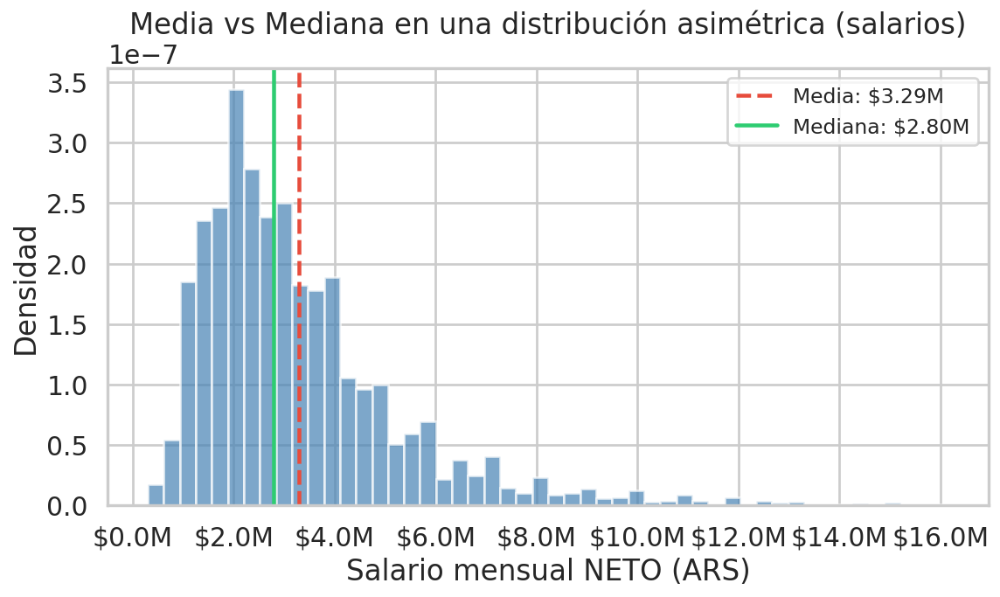
*Fig. 2.1 — Distribución de salarios netos del dataset Sysarmy 2026. Nótese cómo la media (línea roja) se desplaza hacia la derecha respecto a la mediana (línea verde) debido a la asimetría positiva: unos pocos salarios altos "tiran" el promedio hacia arriba.*

### 2.2 Medidas de dispersión

Buscan responder: **¿cuán "esparcidos" están los datos?**

#### Rango

$$R = x_{max} - x_{min}$$

- La diferencia entre el máximo y el mínimo.
- **Problema:** extremadamente sensible a outliers. Un solo valor extremo lo distorsiona completamente.
- Rara vez se usa como medida principal de dispersión.

#### Varianza

$$s^2 = \frac{1}{n-1} \sum_{i=1}^{n} (x_i - \bar{x})^2$$

- Promedio de los desvíos cuadráticos respecto a la media.
- Se divide por (n-1) en vez de n para obtener un **estimador insesgado** de la varianza poblacional (corrección de Bessel).
- **Problema:** la unidad está al cuadrado. Si el salario está en pesos, la varianza está en pesos². Difícil de interpretar.

**En Python:** `df['salary_monthly_NETO'].var()`

#### Desvío estándar

$$s = \sqrt{s^2}$$

- Raíz cuadrada de la varianza. Vuelve a la unidad original.
- **Interpretación:** mide cuánto se desvían, en promedio, los valores respecto a la media.
- **Regla empírica (distribución normal):** ~68% de los datos caen dentro de ±1 desvío, ~95% dentro de ±2 desvíos.
- Sigue siendo **sensible a outliers** (porque se basa en la media).

**En Python:** `df['salary_monthly_NETO'].std()`

#### Rango intercuartílico (IQR)

$$IQR = Q3 - Q1$$

- Diferencia entre el tercer cuartil (percentil 75) y el primer cuartil (percentil 25).
- Contiene el 50% central de los datos.
- **Ventaja:** robusta a outliers (ignora el 25% más bajo y el 25% más alto).
- Es la base del método de Tukey para detectar outliers.

**En Python:** `df['salary_monthly_NETO'].quantile(0.75) - df['salary_monthly_NETO'].quantile(0.25)`

#### Coeficiente de variación (CV)

$$CV = \frac{s}{\bar{x}} \times 100\%$$

- Expresa el desvío estándar como porcentaje de la media.
- **Utilidad:** permite comparar dispersiones entre variables con escalas diferentes. Ej: ¿es más disperso el salario bruto o la edad?
- Solo tiene sentido para variables con media > 0.

### 2.3 Cuantiles y percentiles

Los **cuantiles** dividen los datos ordenados en partes iguales:

| Nombre | Símbolo | Divide en... |
|--------|---------|-------------|
| **Mediana** | Q2 / P50 | 2 partes iguales |
| **Cuartiles** | Q1, Q2, Q3 | 4 partes iguales |
| **Deciles** | D1...D9 | 10 partes iguales |
| **Percentiles** | P1...P99 | 100 partes iguales |

**Interpretación:** El percentil 90 (P90) es el valor por debajo del cual se encuentra el 90% de los datos. Si P90 = $6.000.000, significa que el 90% de los encuestados gana $6M o menos, y solo el 10% gana más.

**Uso en el entregable:** El enunciado sugiere cosas como "el 10% de los mejores sueldos...". Para eso necesitás el P90 (o P75 para el top 25%).

**En Python:**
```python
df['salary_monthly_NETO'].quantile(0.10)  # Percentil 10
df['salary_monthly_NETO'].quantile(0.25)  # Q1
df['salary_monthly_NETO'].quantile(0.90)  # Percentil 90
```

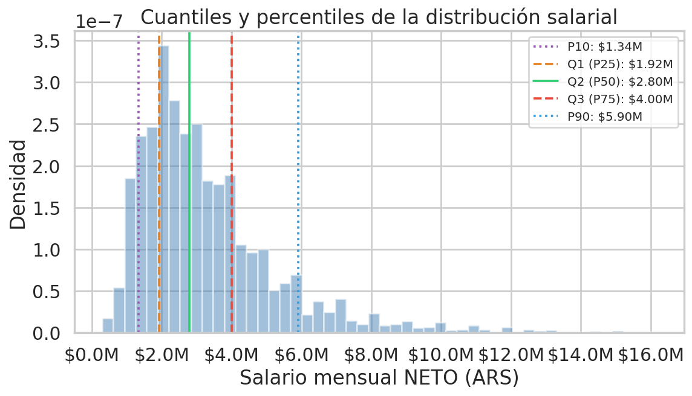
*Fig. 2.2 — Percentiles y cuartiles marcados sobre la distribución salarial. El área entre Q1 y Q3 contiene el 50% central de los datos (IQR). P10 y P90 delimitan el 80% central.*

### 2.4 Asimetría y curtosis

#### Asimetría (skewness)

Mide si la distribución es simétrica o si "se estira" hacia un lado.

| Valor | Interpretación | Forma |
|-------|---------------|-------|
| skew ≈ 0 | Simétrica | Campana centrada |
| skew > 0 | Asimetría positiva (derecha) | Cola larga a la derecha |
| skew < 0 | Asimetría negativa (izquierda) | Cola larga a la izquierda |

**Los salarios** típicamente tienen **asimetría positiva**: la mayoría gana valores medios/bajos, y unos pocos ganan mucho, estirando la cola derecha. Esto hace que la media > mediana.

**En Python:** `df['salary_monthly_NETO'].skew()`

#### Curtosis (kurtosis)

Mide cuán "puntiaguda" o "achatada" es la distribución comparada con la normal.

| Valor | Interpretación |
|-------|---------------|
| curtosis ≈ 0 | Similar a la normal (mesocúrtica) |
| curtosis > 0 | Más puntiaguda, colas más pesadas (leptocúrtica) |
| curtosis < 0 | Más achatada, colas más livianas (platicúrtica) |

**En Python:** `df['salary_monthly_NETO'].kurtosis()`

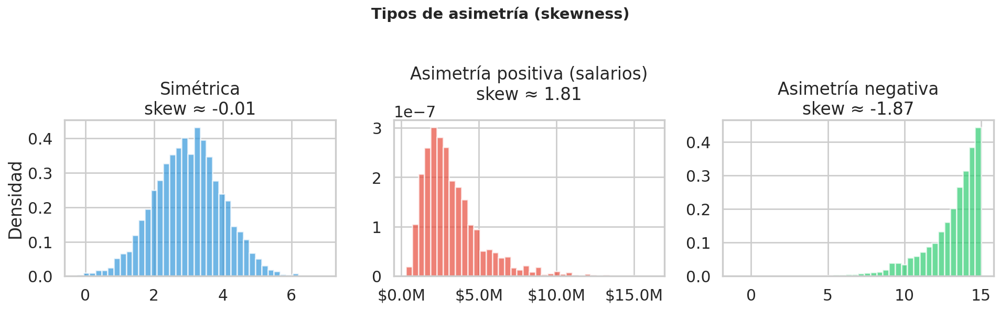
*Fig. 2.3 — Tres tipos de asimetría. Izquierda: distribución simétrica (skew ≈ 0). Centro: distribución de salarios reales con asimetría positiva (cola derecha larga). Derecha: asimetría negativa simulada (cola izquierda larga).*

---

## 3. Visualización de una variable

### 3.1 Histograma

**¿Qué es?** Divide el rango de valores en intervalos (bins) y muestra cuántas observaciones caen en cada intervalo mediante barras.

**¿Qué muestra?** La **forma de la distribución**: dónde se concentran los datos, si es simétrica, si tiene múltiples picos (multimodal), si tiene colas largas.

**Parámetro clave: número de bins.** Pocos bins → pierde detalle. Muchos bins → demasiado ruido. Regla práctica: empezar con 30-50 bins y ajustar.

**Histograma de frecuencia vs densidad:**
- **Frecuencia (counts):** el eje Y muestra la cantidad de observaciones en cada bin.
- **Densidad (`density=True`):** el eje Y se normaliza para que el área total sea 1. Esto permite **superponer histogramas de grupos con distinto tamaño** (ej: 1.774 programadores Python vs 566 de PHP).

**Cuándo usarlo:** siempre que quieras ver la distribución de una variable numérica.

```python
plt.hist(df['salary_monthly_NETO'], bins=40, density=True, alpha=0.7)
```

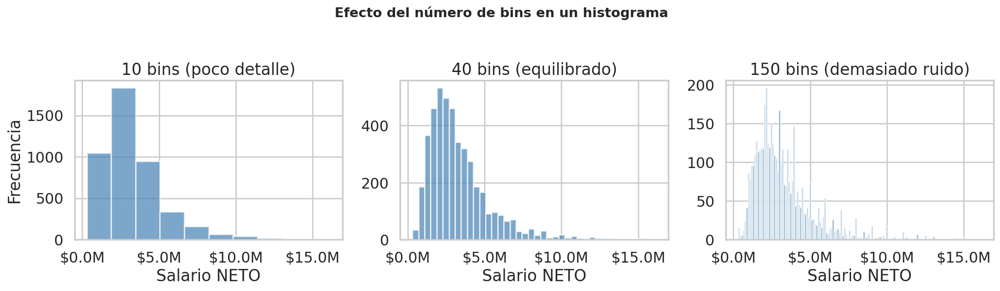
*Fig. 3.1 — El mismo dataset con distinto número de bins. Con 10 bins se pierde detalle; con 40 se logra un buen equilibrio; con 150 aparece ruido excesivo. La elección del número de bins afecta la interpretación.*

### 3.2 Boxplot (diagrama de caja)

**¿Qué es?** Un resumen visual de 5 números:

```
                    ┌─── Máximo (o bigote superior)
                    │
            ┌───────┤
            │       │ ← Q3 (75%)
            │  ───  │ ← Mediana (50%)
            │       │ ← Q1 (25%)
            └───────┤
                    │
                    └─── Mínimo (o bigote inferior)

            ◆ ◆     ← Outliers (puntos individuales)
```

**Los bigotes** se extienden hasta 1.5 × IQR desde Q1 y Q3. Cualquier valor fuera de los bigotes se muestra como un punto individual (outlier).

**¿Qué muestra?**
- **Centro:** la línea de la mediana.
- **Dispersión:** el tamaño de la caja (IQR).
- **Asimetría:** si la mediana no está centrada en la caja.
- **Outliers:** puntos fuera de los bigotes.

**Cuándo usarlo:** para **comparar distribuciones** entre grupos. Ej: un boxplot de salario para cada lenguaje de programación.

```python
sns.boxplot(data=df, x='salary_monthly_NETO', y='language', showfliers=False)
```

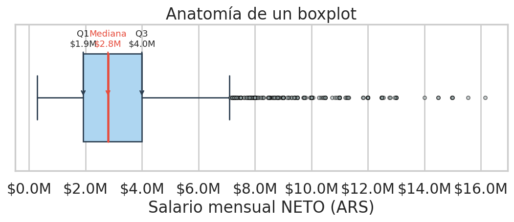
*Fig. 3.2 — Anatomía de un boxplot sobre los salarios netos reales. Se señalan Q1, la mediana y Q3. Los bigotes se extienden hasta 1.5×IQR. Puntos fuera de los bigotes son outliers.*

### 3.3 Violin plot

**¿Qué es?** Combina un boxplot con una estimación de densidad (KDE). La "anchura" del violín en cada punto muestra la densidad de datos en ese valor.

**Ventaja sobre el boxplot:** muestra la **forma completa** de la distribución, no solo 5 números. Permite ver bimodalidad (dos picos), que un boxplot oculta.

**Cuándo usarlo:** cuando querés más detalle que un boxplot, especialmente si sospechás que la distribución tiene una forma interesante.

```python
sns.violinplot(data=df, x='salary_monthly_NETO', y='language', inner='quartile')
```

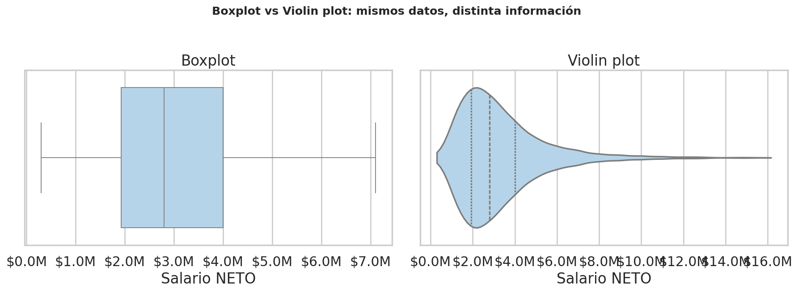
*Fig. 3.3 — Comparación entre boxplot y violin plot sobre los mismos datos salariales. El violin plot muestra la forma completa de la densidad, revelando información que el boxplot oculta (como concentraciones o multimodalidad).*

### 3.4 Gráfico de barras (variables categóricas)

Para variables categóricas, el equivalente al histograma es el **gráfico de barras** de frecuencias.

- Cada barra representa una categoría.
- La altura indica la frecuencia (absoluta o relativa).
- A diferencia del histograma, **las barras no se tocan** (son categorías discretas, no un continuo).

```python
df['work_seniority'].value_counts().plot(kind='bar')
```

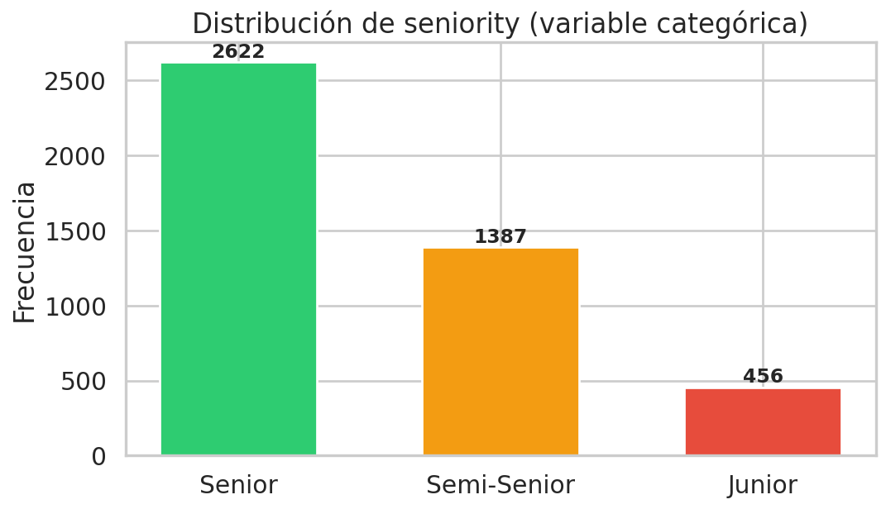
*Fig. 3.4 — Distribución de la variable categórica `work_seniority`. Las barras no se tocan porque representan categorías discretas, no un continuo. Senior es la categoría más frecuente.*

### 3.5 KDE (Kernel Density Estimation)

**¿Qué es?** Una versión "suavizada" del histograma. En vez de bins discretos, estima una curva continua de densidad colocando una "campana" pequeña (kernel) sobre cada dato y sumándolas.

**Ventaja:** produce una curva suave que es más fácil de comparar entre grupos.

**Parámetro clave: bandwidth.** Controla cuán suave es la curva. Muy bajo → demasiado ruidoso. Muy alto → pierde detalle.

```python
sns.kdeplot(data=df, x='salary_monthly_NETO', hue='language')
```

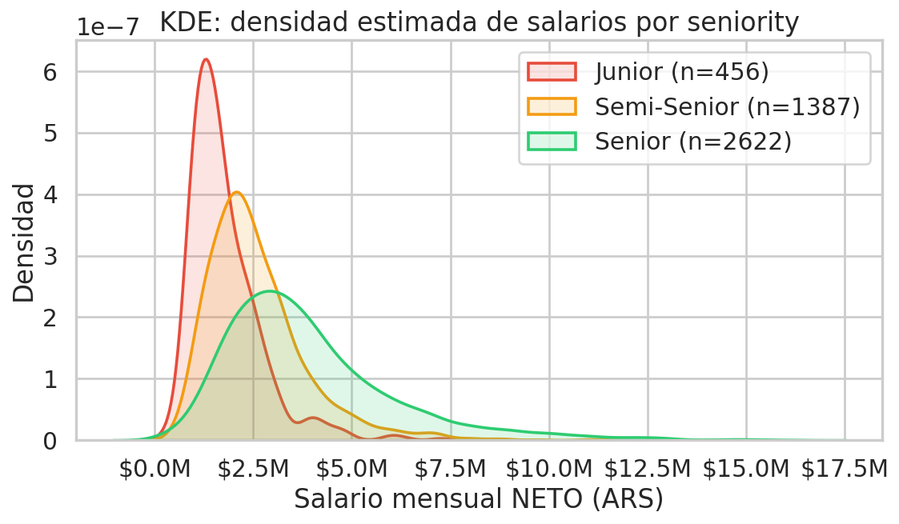
*Fig. 3.5 — Estimación de densidad por kernel (KDE) del salario neto, segmentado por seniority. Se aprecia cómo los Seniors tienen una distribución desplazada a la derecha (salarios más altos), mientras que los Juniors se concentran en valores más bajos.*

---

## 4. Limpieza y preparación de datos

### 4.1 Valores faltantes (NaN)

**¿Qué son?** Celdas sin dato. En pandas se representan como `NaN` (Not a Number).

**¿Por qué importan?** Porque:
- La mayoría de las funciones estadísticas los ignoran automáticamente, pero reducen la muestra.
- Pueden introducir sesgo si la falta de dato no es aleatoria (ej: quienes no declaran salario podrían ser los que más o menos ganan).

**Estrategias:**
| Estrategia | Cuándo usarla |
|-----------|---------------|
| **Eliminar filas** con NaN | Cuando son pocas (< 5%) y la pérdida es tolerable |
| **Eliminar columnas** con muchos NaN | Cuando > 50% de NaN y la columna no es esencial |
| **Imputar** (reemplazar) | Cuando querés conservar las filas (ej: reemplazar con la mediana) |
| **Dejar como están** | Cuando la función que usás maneja NaN correctamente |

**En el entregable:** `salary_monthly_NETO` tiene 4.5% de NaN. Lo razonable es eliminar esas filas para el análisis de salarios.

#### 🎯 Caso especial: NaN con significado semántico

No todos los `NaN` significan "dato faltante". A veces son la forma canónica del dataset para codificar una **ausencia declarada** que tiene un significado concreto. Conviene verificar antes de descartar.

**Ejemplo del entregable:** en la columna `salary_in_usd` hay 3.356 `NaN`. Si uno los tratara como "dato faltante", pensaría en descartarlos o imputarlos. Pero al cruzarlos con la columna booleana `sueldo_dolarizado` del propio dataset se descubre que:

```
NaN en salary_in_usd      ≡      sueldo_dolarizado = False
(3.356 filas)                    (3.356 filas)
coincidencia exacta
```

Es decir, el dataset ya codifica implícitamente que "`NaN` en `salary_in_usd`" significa **"el respondente no declaró ninguna forma de dolarización, cobra 100% en pesos argentinos"**. No es dato faltante: es un estado específico de la variable que simplemente se codificó mediante la ausencia de las otras tres opciones.

**Regla práctica:** antes de asumir que un conjunto grande de `NaN` en una columna categórica es "dato faltante", revisar si existe otra columna (booleana, derivada o redundante) que confirme o contradiga la interpretación. En el ejemplo anterior, tratar esos `NaN` como "dato faltante" y descartarlos habría eliminado arbitrariamente el **68% del dataset** — el grupo más numeroso — sin razón válida.

**Cómo reportarlo en el informe:**
Conviene documentar explícitamente la interpretación asumida y la evidencia que la respalda. En el entregable la etiqueta `Cobro en pesos (NaN)` se usa en lugar de algo como "(sin declarar)" justamente para hacer transparente que la interpretación es deliberada, no una suposición tácita.

### 4.2 Detección de outliers

**¿Qué es un outlier?** Un valor que se aleja significativamente del patrón general de los datos. Puede ser:
- **Un error de carga:** alguien puso $1,6 en vez de $1.600.000.
- **Un valor legítimo pero extremo:** un CEO que gana $50M.

**¿Por qué eliminarlos?** Porque distorsionan medidas como la media y el desvío estándar, y pueden ocultar patrones en las visualizaciones.

#### Método del IQR (Tukey)

Es el método más usado y el que implementa el boxplot:

```
Límite inferior = Q1 - 1.5 × IQR
Límite superior = Q3 + 1.5 × IQR
```

Todo valor fuera de estos límites se considera outlier.

**¿Por qué 1.5?** Es una convención propuesta por John Tukey. Si los datos fueran perfectamente normales, este criterio capturaría el 99.3% de los datos. En la práctica, es un buen balance entre ser demasiado permisivo y demasiado estricto.

##### IQR estratificado por subpoblación

Cuando el dataset contiene **subpoblaciones con centros y escalas naturalmente distintas** (por ejemplo, sueldos en pesos vs sueldos en dólares), aplicar la regla `1,5·IQR` de forma global puede llevar a resultados engañosos. El IQR calculado sobre la población combinada queda arrastrado por la mezcla, y los límites resultantes pueden ser:

- **Demasiado amplios** para la subpoblación de menor escala (deja pasar valores que son claramente extremos dentro de su propio grupo).
- **Demasiado estrechos** para la subpoblación de mayor escala (marca como atípicos valores que son normales dentro de su propio grupo).

**Solución:** calcular `Q1`, `Q3` e `IQR` **por separado dentro de cada subpoblación** y aplicar la regla de Tukey independientemente. Cada observación queda evaluada contra el rango natural de su propio grupo, no contra una mezcla.

**Ejemplo del entregable (filtro F4):** en el dataset sysarmy hay tres subpoblaciones según la moneda efectiva del sueldo:

| Grupo | Mediana | Q1 | Q3 | IQR | Límite superior |
|---|---:|---:|---:|---:|---:|
| ARS | ~2,5 M | ~1,7 M | ~3,5 M | ~1,8 M | ~6,2 M |
| USD parcial | ~3,1 M | ~2,1 M | ~4,5 M | ~2,4 M | ~8,1 M |
| USD total | ~5,0 M | ~3,0 M | ~7,0 M | ~4,0 M | ~13,0 M |

Un cálculo combinado daría un único límite cercano a `~6,8 M`, que sería simultáneamente demasiado amplio para el grupo ARS (deja pasar sueldos de 6,5 M que son claramente atípicos para pesos puros) y demasiado estrecho para USD total (elimina sueldos de 8 M que son perfectamente normales para ese grupo). La estratificación resuelve el problema usando la propia distribución de referencia de cada subpoblación.

**Código:**
```python
def mascara_iqr_por_grupo(df, col, grupo):
    mask = pd.Series(False, index=df.index)
    for _, sub in df.groupby(grupo):
        q1, q3 = sub[col].quantile([0.25, 0.75])
        iqr = q3 - q1
        lo, hi = q1 - 1.5 * iqr, q3 + 1.5 * iqr
        mask.loc[sub.index] = sub[col].between(lo, hi)
    return mask
```

#### Método del Z-score

$$z_i = \frac{x_i - \bar{x}}{s}$$

Si |z| > 3, el valor se considera outlier (está a más de 3 desvíos de la media).

**Problema:** usa la media y el desvío, que ya están distorsionados por los outliers. Es un razonamiento circular.

#### Método por percentiles

Descartar valores por debajo del P5 y por encima del P95 (o P1/P99). Es más simple pero arbitrario.

**Recomendación para el entregable:** usar el método IQR, posiblemente combinado con un piso mínimo lógico (ej: salario mínimo real).

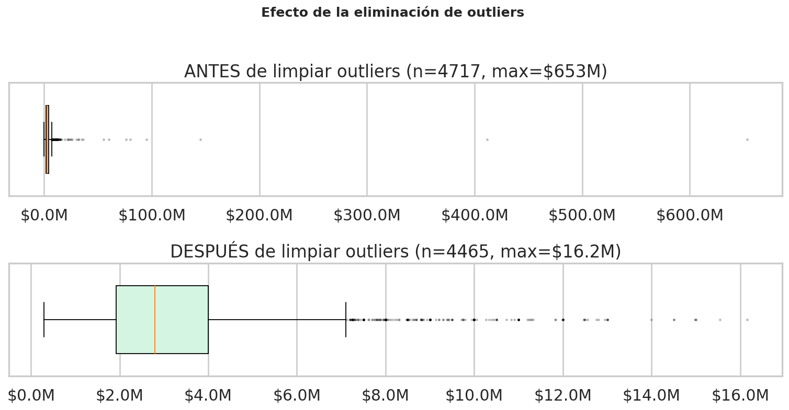
*Fig. 4.1 — Efecto de la limpieza de outliers. Arriba: datos crudos con valores extremos que comprimen toda la distribución visualmente. Abajo: tras eliminar outliers, se aprecia la distribución real de los salarios.*

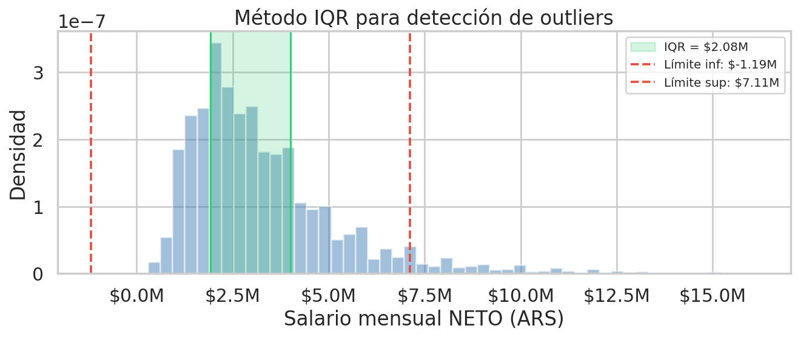
*Fig. 4.2 — Método IQR para detección de outliers. El área verde marca el rango intercuartílico (Q1 a Q3). Las líneas rojas punteadas indican los límites: Q1 - 1.5×IQR y Q3 + 1.5×IQR. Todo valor fuera de estos límites se considera outlier.*

### 4.3 Selección de sub-población

A veces no queremos analizar todos los datos sino un **subgrupo específico**. Esto se llama seleccionar una sub-población.

**Ejemplos válidos:**
- Solo Full-Time (para que los salarios sean comparables).
- Solo programadores (excluyendo managers, QA, etc.).
- Solo Buenos Aires y Córdoba (las provincias con más datos).

**Requisito fundamental:** **justificar la decisión**. El enunciado lo dice explícitamente: "deben justificar su elección y reformular la pregunta inicial de ser necesario".

**Ejemplo de reformulación:**
- Pregunta original: "¿Cuáles son los lenguajes asociados a los mejores salarios?"
- Tras filtrar Full-Time: "¿Cuáles son los lenguajes asociados a los mejores salarios **entre trabajadores Full-Time del sector IT en Argentina**?"

### 4.4 Justificación de decisiones

Cada decisión de limpieza debe estar **explícitamente justificada** en el informe. No alcanza con decir "eliminé outliers". Hay que decir:

> "Se eliminaron N registros con salario neto inferior a $300.000, ya que representan valores claramente erróneos (posibles errores de tipeo). Se utilizó el método IQR sobre los percentiles 5-95 para eliminar outliers adicionales, resultando en un rango de salarios entre $X y $Y. Se restringió el análisis a trabajadores Full-Time (N registros) para garantizar la comparabilidad de salarios entre lenguajes."

---

## 5. Ejercicio 1: Análisis descriptivo comparativo

El objetivo es comparar salarios **entre grupos** (lenguajes de programación). El enunciado pide elegir UNA de tres opciones metodológicas. Acá explicamos las tres.

> **💡 Nota sobre la combinación de opciones.** La consigna dice literalmente *"Elegir UNA de las siguientes opciones"*, pero en la práctica las opciones **A (comparar distribuciones con visualizaciones)** y **B (comparar medidas descriptivas)** son complementarias: la visualización responde la pregunta principal y las medidas descriptivas la respaldan cuantitativamente. Cuando se combinan, **es importante declararlo explícitamente** al inicio del informe para evitar ambigüedad frente a un corrector. Combinar A y B sin aclararlo puede interpretarse como no haber tomado una decisión metodológica; declararlo transforma la combinación en una decisión consciente y defendible.

### 5.1 Comparación de distribuciones

**Idea:** Para cada lenguaje, obtener la distribución de salarios y compararlas visualmente.

**Herramientas:**
- **Boxplots lado a lado:** permite comparar medianas, IQR y outliers de un vistazo.
- **Violin plots:** agrega información sobre la forma de la distribución.
- **Histogramas superpuestos:** usa `density=True` para que sean comparables aunque los grupos tengan distinto tamaño.
- **KDE superpuestos:** versión suave del histograma.
- **ECDF (función de distribución acumulada empírica):** muestra P(X ≤ x) para cada x. Si una curva está "a la derecha" de otra, ese grupo tiene valores más altos.

**Qué buscar:**
- ¿La distribución de un lenguaje está **desplazada** respecto a otra? (diferencia en centralización)
- ¿Un lenguaje tiene más **dispersión** que otro?
- ¿Las distribuciones se **superponen** mucho o poco?
- ¿Alguna distribución tiene una **forma inusual** (bimodal, asimétrica)?

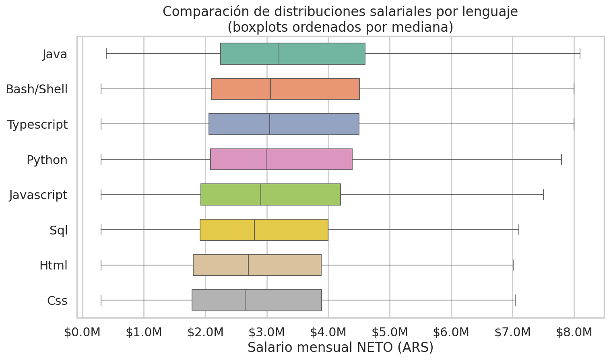
*Fig. 5.1 — Boxplots comparativos de salario neto por lenguaje de programación, ordenados por mediana descendente. Permite comparar rápidamente la posición central y la dispersión de cada grupo.*

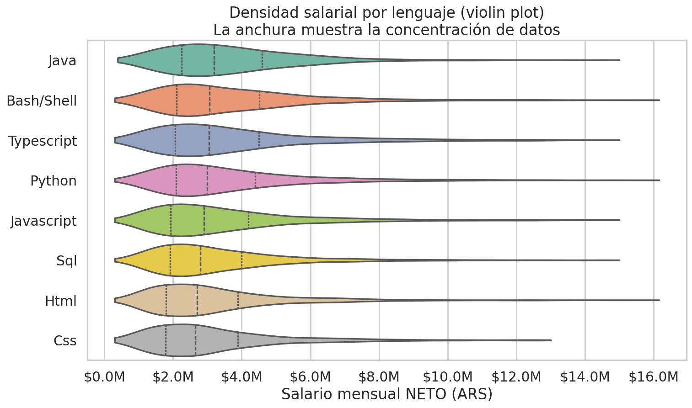
*Fig. 5.2 — Violin plots de los mismos datos. La forma del "violín" revela la concentración de salarios en cada lenguaje: algunos tienen distribuciones más compactas que otros.*

### 5.2 Comparación de medidas descriptivas

**Idea:** Calcular estadísticos resumen para cada lenguaje y compararlos en una tabla.

**Medidas útiles:**
| Medida | ¿Qué compara? |
|--------|---------------|
| Mediana | Centro (robusto) |
| Media | Centro (sensible a outliers) |
| Desvío estándar | Dispersión |
| IQR | Dispersión (robusta) |
| P10, P90 | Colas de la distribución |
| Skewness | Forma (asimetría) |

**El enunciado sugiere ser creativo.** Ejemplo: calcular qué porcentaje de programadores de cada lenguaje están en el top 10% global de salarios.

> "El 10% de los mejores sueldos los ganan, en su mayoría, programadores que saben Kotlin!"

Para hacer esta afirmación necesitás:
1. Calcular el P90 global (ej: $6.000.000).
2. Filtrar los encuestados con salario > P90.
3. Contar qué lenguajes usan esas personas.
4. Ver si algún lenguaje tiene > 50% de representación en ese grupo.

### 5.3 Comparación de probabilidades

**Idea:** Calcular probabilidades condicionales y compararlas.

**Probabilidad condicional (frecuentista):**

$$P(A|B) = \frac{\text{número de casos con A y B}}{\text{número de casos con B}}$$

**Ejemplo:** "Si sabés Python, ¿cuál es la probabilidad de ganar más de $4M?"

$$P(\text{salario} > 4M \mid \text{sabe Python}) = \frac{\text{personas que saben Python Y ganan > 4M}}{\text{personas que saben Python}}$$

**Comparación:** Podés calcular esta probabilidad para cada lenguaje y compararlas:
- P(salario > 4M | Python) = 35%
- P(salario > 4M | Go) = 48%
- P(salario > 4M | PHP) = 22%

Y concluir: "Saber Go se asocia a un 37% más de chances de ganar > $4M comparado con Python" (48/35 - 1 = 37%).

**Cuidado:** esto es una **asociación**, no causalidad. No significa que aprender Go te haga ganar más. Puede ser que Go lo usan perfiles más senior.

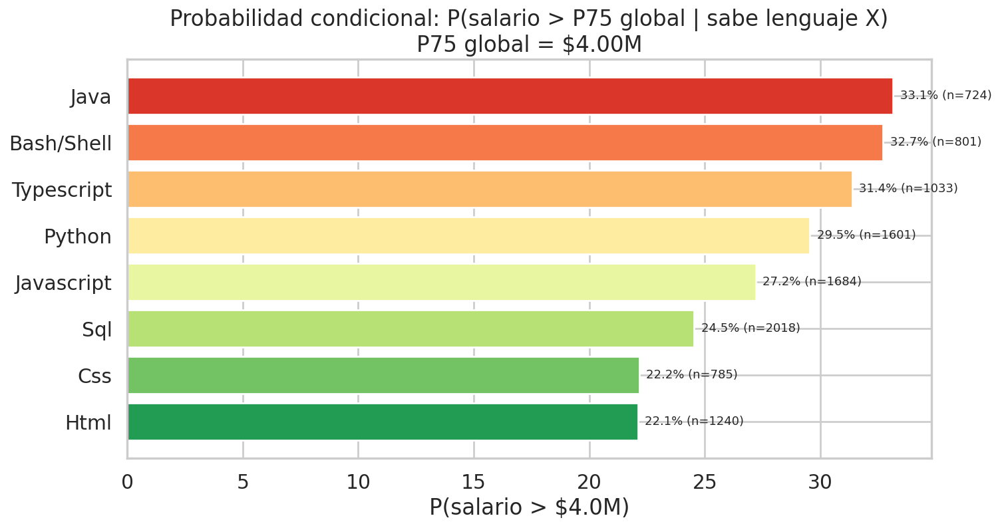
*Fig. 5.3 — Probabilidad de estar en el top 25% de salarios (por encima del P75 global) según lenguaje de programación. Cada barra muestra P(salario > P75 | sabe lenguaje X). Lenguajes de mayor demanda especializada tienden a tener probabilidades más altas.*

### 5.4 Variables confusoras y sesgo

Una **variable confusora** es una tercera variable que afecta tanto a la variable explicativa como a la respuesta, generando una asociación espuria.

**Ejemplo clásico en este dataset:**

```
    Go  ────────────→  Salario alto
     ↑                    ↑
     │                    │
     └── Seniority ───────┘
```

Puede que Go no cause salarios altos, sino que los programadores Senior (que ganan más) tienden a usar Go. La variable confusora es `work_seniority`.

**¿Cómo manejar esto?** 
- Mencionarlo como limitación.
- Opcionalmente, controlar por seniority (ej: comparar salarios de Go vs Python solo entre Seniors).

---

## 6. Estadística descriptiva bivariada

"Bivariada" = analizamos **dos variables** simultáneamente. El objetivo es medir el grado de **asociación** entre ellas.

### 6.1 Covarianza

Mide cómo varían conjuntamente dos variables:

$$Cov(X, Y) = \frac{1}{n-1} \sum_{i=1}^{n} (x_i - \bar{x})(y_i - \bar{y})$$

| Valor | Interpretación |
|-------|---------------|
| Cov > 0 | Cuando X sube, Y tiende a subir |
| Cov < 0 | Cuando X sube, Y tiende a bajar |
| Cov ≈ 0 | No hay relación lineal |

**Problema:** su magnitud depende de las unidades de las variables. Cov(salario_en_pesos, edad) ≠ Cov(salario_en_dólares, edad), aunque la relación sea la misma.

### 6.2 Coeficiente de correlación de Pearson (r)

Resuelve el problema de la covarianza **normalizándola**:

$$r = \frac{Cov(X, Y)}{s_X \cdot s_Y}$$

| Valor | Interpretación |
|-------|---------------|
| r = +1 | Correlación lineal perfecta positiva |
| r = -1 | Correlación lineal perfecta negativa |
| r = 0 | Sin correlación **lineal** |
| 0.7 < \|r\| ≤ 1 | Fuerte |
| 0.4 < \|r\| ≤ 0.7 | Moderada |
| 0 < \|r\| ≤ 0.4 | Débil |

**Limitaciones:**
- Solo mide relaciones **lineales**. Si la relación es cuadrática, r puede ser ≈ 0 aunque la relación sea perfecta.
- Sensible a outliers.

**En Python:** `df['salary_monthly_BRUTO'].corr(df['salary_monthly_NETO'])`

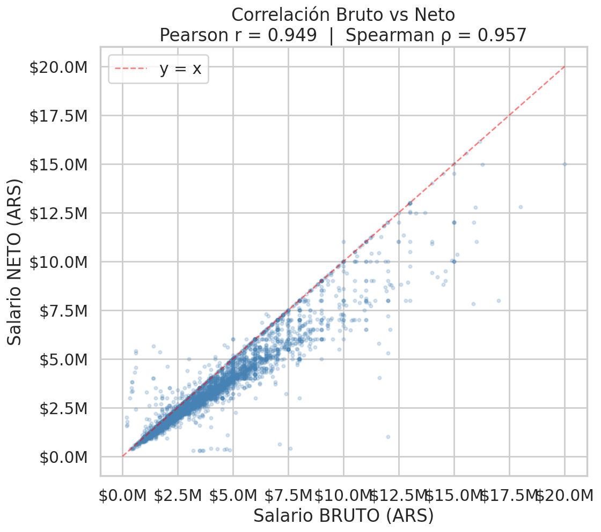
*Fig. 6.1 — Scatterplot de salario bruto vs neto con coeficientes de correlación. La línea roja punteada (y=x) sirve de referencia: los puntos por debajo indican que el neto es menor al bruto (lo esperado por deducciones). La correlación es muy alta, indicando una relación casi determinística.*

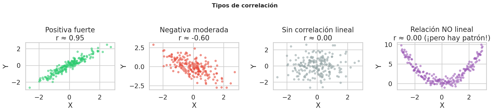
*Fig. 6.2 — Cuatro escenarios de correlación. De izquierda a derecha: positiva fuerte, negativa moderada, sin correlación lineal, y relación no lineal (cuadrática) donde Pearson r ≈ 0 a pesar de existir un patrón claro. Esto ilustra la limitación de Pearson.*

### 6.3 Coeficiente de correlación de Spearman (ρ)

En vez de medir la correlación lineal entre los valores, mide la correlación entre los **rangos** (posiciones en el ordenamiento).

**Ventajas sobre Pearson:**
- Detecta relaciones **monótonas** (no solo lineales). Si Y siempre crece cuando X crece, pero no en forma de recta, Spearman lo captura.
- **Robusta a outliers** (porque trabaja con rangos, no con valores).

**Cuándo usar cada uno:**
| Situación | Usar |
|-----------|------|
| Relación lineal, sin outliers | Pearson |
| Relación monótona no lineal | **Spearman** |
| Datos con outliers | **Spearman** |
| Variables ordinales | **Spearman** |

**En Python:** `df['salary_monthly_BRUTO'].corr(df['salary_monthly_NETO'], method='spearman')`

> **📘 Según la filmina de clase 03 (*Varias Variables*):**
> *"Para (X, Y) par de v.a., [usar Spearman] si no sabemos si su distribución conjunta es Normal o tenemos pocos datos. O si la(s) variable(s) son del tipo ordinal."*
>
> Los sueldos del dataset sysarmy son **claramente no-normales** (distribución sesgada a la derecha, con cola larga), por lo que Spearman es la elección más adecuada desde el punto de vista de la filmina. En el entregable se reportan **ambas correlaciones** (Pearson y Spearman) para la comparación Bruto ↔ Neto, para mostrar que ambas llegan al mismo diagnóstico cuando la relación es casi lineal y fuerte. Para la matriz de correlación entre las tres numéricas del ejercicio 2a se usa Pearson (por coherencia con el notebook 03 del curso, que utiliza `np.corrcoef`), aunque Spearman sería igualmente defendible.

### 6.4 Matriz de correlación

Cuando tenés muchas variables numéricas, calculás la correlación entre **todos los pares** y la organizás en una matriz. Se visualiza como un **heatmap** con colores.

**Lectura:**
- La diagonal siempre es 1 (cada variable correlaciona perfectamente consigo misma).
- Es simétrica (corr(X,Y) = corr(Y,X)).
- Buscá celdas con colores intensos (correlaciones fuertes).

**En Python:**
```python
corr_matrix = df[['salary_monthly_BRUTO', 'salary_monthly_NETO', 
                   'profile_years_experience', 'profile_age']].corr()
sns.heatmap(corr_matrix, annot=True, cmap='coolwarm', center=0)
```

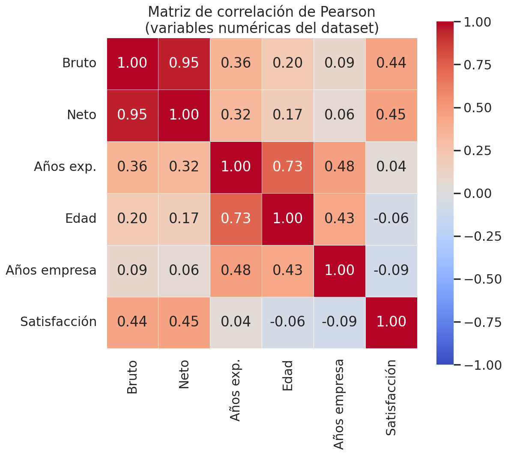
*Fig. 6.3 — Matriz de correlación de Pearson entre variables numéricas del dataset. Los colores cálidos (rojo) indican correlación positiva; los fríos (azul) negativa. Se destaca la correlación casi perfecta entre bruto y neto (0.97) y la correlación moderada entre años de experiencia y edad.*

### 6.5 Columnas derivadas para evaluar redundancia

Cuando dos variables tienen correlación muy alta (por ejemplo, `|r| > 0,9`), conviene complementar la correlación con el análisis de la **columna derivada** que las relaciona. Dos variables casi colineales no solo "se mueven juntas": su diferencia o cociente suele tener una estructura propia informativa.

**Técnica tomada del práctico de la clase 03:** ante una alta correlación entre dos variables `X` e `Y`, construir la columna derivada `Z = X − Y` (o `Z = X / Y`, según el caso) y estudiar su distribución con estadísticos descriptivos e histogramas. Si `Z` tiene una distribución estrecha y centrada, `X` e `Y` son efectivamente **redundantes** para el análisis y una de las dos podría quitarse del formulario sin pérdida sustancial.

**Ejemplo del entregable (ejercicio 2b):** para estudiar la relación entre sueldo BRUTO y sueldo NETO se construye:

```python
bn['descuentos']     = bn['salary_monthly_BRUTO'] - bn['salary_monthly_NETO']
bn['descuentos_pct'] = 100 * bn['descuentos'] / bn['salary_monthly_BRUTO']
```

Y se reporta el resumen descriptivo de ambas columnas. Si los descuentos relativos caen consistentemente en un rango estrecho (por ejemplo, entre 15% y 19%), eso implica que `NETO ≈ 0,82 × BRUTO` con poca variación, y la información de BRUTO queda **descriptivamente redundante** con NETO. Esto responde la pregunta implícita *"¿conviene quitar BRUTO del formulario para simplificarlo?"* con respaldo empírico y sin necesidad de herramientas inferenciales.

**Ventaja del abordaje:** no solo se responde la pregunta de asociación con un coeficiente (Pearson/Spearman), sino que se caracteriza **qué queda cuando se elimina la parte compartida entre las dos variables**. La columna derivada es la "sobra" que permanece después de la relación lineal — si la sobra es pequeña y estable, la redundancia queda confirmada.

---

## 7. Densidad de probabilidad

Estos conceptos son centrales para el Ejercicio 2.

### 7.1 Densidad marginal

La densidad **marginal** es la distribución de **una sola variable**, ignorando todas las demás. Es lo que vimos en la sección 2 (estadística univariada).

**¿Por qué se llama "marginal"?** Históricamente, en tablas de doble entrada, los totales de filas y columnas se escribían en los **márgenes** de la tabla.

**Ejemplo:** La distribución de `salary_monthly_NETO` considerando todos los encuestados, sin importar su género, seniority o lenguaje. Es la densidad "sin condiciones".

### 7.2 Densidad conjunta

La densidad **conjunta** describe el comportamiento **simultáneo** de dos o más variables. Responde a preguntas como: "¿Qué tan probable es que alguien tenga 30 años Y gane $5M?"

**Para dos variables numéricas** se visualiza como:
- **Scatterplot:** cada punto es una observación (x, y).
- **Heatmap 2D:** divide el plano en celdas y cuenta las observaciones en cada celda.
- **KDE 2D (contour plot):** curvas de nivel de densidad, como un mapa topográfico.

**Interpretación:** Si los puntos del scatterplot se alinean en una dirección, hay asociación. Si forman una nube circular, no hay asociación lineal.

**Para una numérica + una categórica:**
- **Boxplot por grupo** (ej: salario por seniority).
- **Histogramas superpuestos** con hue.

### 7.3 Densidad condicional

La densidad **condicional** es la distribución de una variable **dado que otra variable tiene un valor específico**.

$$f(Y | X = x) = \frac{f(X, Y)}{f(X = x)}$$

**En la práctica (datos discretos/categóricos):** es simplemente filtrar el dataset por un valor de X y mirar la distribución de Y en ese subgrupo.

**Ejemplo del Ejercicio 2c:** "Distribución del salario **dado que** el nivel de estudio es Universitario" vs "Distribución del salario **dado que** el nivel de estudio es Terciario".

```python
# Densidad condicional de salario | nivel = Universitario
salarios_univ = df[df['profile_studies_level'] == 'Universitario']['salary_monthly_NETO']

# Densidad condicional de salario | nivel = Terciario
salarios_terc = df[df['profile_studies_level'] == 'Terciario']['salary_monthly_NETO']
```

**Comparar ambas:** si son iguales → las variables son independientes. Si difieren → hay dependencia.

### 7.4 Independencia estadística

Dos variables X e Y son **independientes** si conocer el valor de una no aporta información sobre la otra.

**Formalmente:** X e Y son independientes si y solo si:

$$f(X, Y) = f(X) \cdot f(Y)$$

O equivalentemente:

$$f(Y | X) = f(Y)$$

(la distribución de Y no cambia al condicionar por X)

**¿Cómo evaluar independencia en la práctica?**
1. **Visualmente:** comparar las distribuciones condicionales. Si son iguales, sugiere independencia.
2. **Numéricamente:** comparar medias, medianas y desvíos entre subgrupos.
3. **Correlación:** si r ≈ 0, no hay relación lineal (pero podría haber relación no lineal).
4. **Comparación de probabilidades condicionales** (abordaje de la clase 01, ver abajo).
5. **Tests formales:** Chi-cuadrado, Mann-Whitney, Kolmogorov-Smirnov (esto es para la Parte 2 del entregable, no la Parte 1).

**Importante:** correlación = 0 **NO implica** independencia. La independencia implica correlación = 0, pero no al revés. Puede haber relación no lineal con correlación nula.

#### Abordaje descriptivo: `P(A|B)` vs `P(A)` (clase 01)

La filmina de clase 01 (*Probabilidad*) define formalmente la independencia de dos conjuntos `A` y `B` como:

$$P(A | B) = P(A)  \iff  P(A \cap B) = P(A) \cdot P(B)$$

Y propone un abordaje **puramente descriptivo** (sin test inferencial) para evaluar independencia en una muestra concreta: calcular `P(A)` marginal y `P(A|B)` condicional, y comparar. Si ambas probabilidades son parecidas, la muestra es compatible con independencia; si son muy distintas, hay evidencia descriptiva de asociación.

**Receta de aplicación** (esta es la que se usa en el ejercicio 2c del entregable):

1. Definir un **evento `A`** basado en la variable numérica de interés. Por ejemplo, `A = "sueldo NETO mayor que la mediana global"`.
2. Definir **eventos `B_i`** basados en las subpoblaciones de la variable categórica. Por ejemplo, `B_1 = "nivel de estudio = Universitario"`, `B_2 = "nivel de estudio = Terciario"`.
3. Calcular `P(A)` sobre toda la muestra.
4. Calcular `P(A | B_i)` para cada subpoblación usando la definición frecuentista:
   $$P(A \mid B_i) = \frac{\text{observaciones en } A \cap B_i}{\text{observaciones en } B_i}$$
5. Calcular la **distancia descriptiva** `|P(A|B_i) − P(A)|` para cada subpoblación.

**Interpretación:**
- Si todas las distancias son cercanas a cero → la muestra es compatible con independencia entre las dos variables.
- Si alguna distancia es apreciablemente distinta de cero → en la muestra, la variable categórica **sí aporta información** sobre la variable numérica. No son independientes.

**Este abordaje NO realiza un test de independencia.** No produce un p-valor ni una región de rechazo. Es una herramienta puramente descriptiva que compara probabilidades empíricas. La conclusión se formula en términos de *"en esta muestra, la distancia es de X"*, sin extrapolar a la población general. Un test formal (Chi-cuadrado) es material de la parte 2 del entregable.

**Ejemplo del dataset:** ¿Son independientes el salario y el nivel de estudio? Si al separar por nivel de estudio las distribuciones de salario son muy similares, entonces son aproximadamente independientes. Si los universitarios ganan sistemáticamente más, no son independientes.

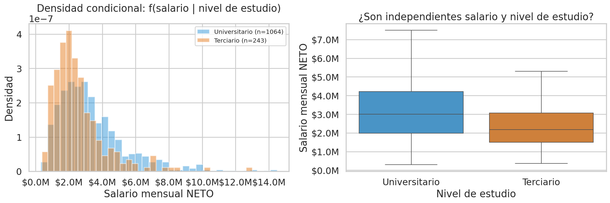
*Fig. 7.1 — Izquierda: histogramas superpuestos de salario condicional al nivel de estudio (Universitario vs Terciario). Derecha: boxplots comparativos. Las diferencias entre ambas distribuciones sugieren que salario y nivel de estudio NO son completamente independientes.*

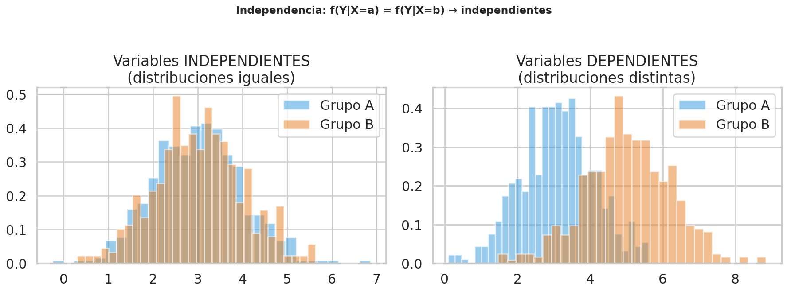
*Fig. 7.2 — Ejemplo didáctico de independencia. Izquierda: dos grupos con distribuciones idénticas → las variables son independientes (f(Y|A) = f(Y|B)). Derecha: distribuciones claramente distintas → las variables son dependientes (f(Y|A) ≠ f(Y|B)).*

---

## 8. Visualización multivariada

### 8.1 Scatterplot (diagrama de dispersión)

**¿Qué es?** Cada observación se representa como un punto en un plano cartesiano: una variable en el eje X, otra en el eje Y.

**¿Qué muestra?**
- **Dirección:** ¿la relación es positiva (sube-sube) o negativa (sube-baja)?
- **Forma:** ¿es lineal, cuadrática, exponencial, o sin patrón?
- **Fuerza:** ¿los puntos están apretados alrededor de un patrón o muy dispersos?
- **Outliers:** puntos alejados del patrón general.

```python
plt.scatter(df['profile_years_experience'], df['salary_monthly_NETO'], alpha=0.3)
```

### 8.2 Scatterplot con hue (Ejercicio 2d)

**¿Qué es?** Un scatterplot donde los puntos se colorean según una **variable categórica**. Esto agrega una **tercera dimensión** (la categoría) al gráfico 2D.

**¿Qué permite ver?**
- Si la relación entre X e Y **cambia** según la categoría.
- Si los grupos se **separan** en clusters.
- Si hay **interacción** entre las variables.

**Ejemplo:** Scatter de salario vs experiencia, coloreado por seniority:
- Si los colores se separan claramente → seniority discrimina bien.
- Si se mezclan → seniority no aporta información adicional más allá de experiencia.

```python
sns.scatterplot(data=df, x='profile_years_experience', y='salary_monthly_NETO', 
                hue='work_seniority', alpha=0.3)
```

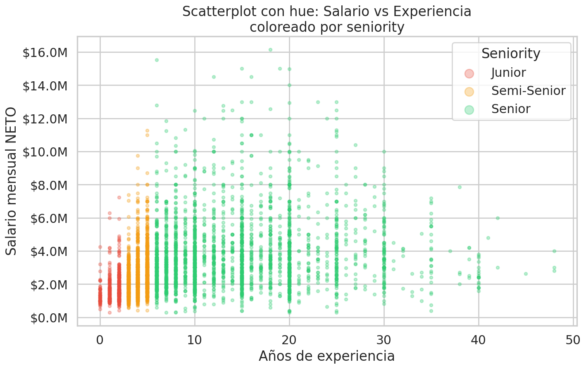
*Fig. 8.1 — Scatterplot de salario vs experiencia, coloreado por seniority. Se aprecia cómo los Seniors (verde) dominan la zona de salarios altos y mayor experiencia, mientras que los Juniors (rojo) se concentran abajo a la izquierda. El color agrega una tercera dimensión informativa al gráfico 2D.*

**Parámetro `hue` en seaborn:** es la variable categórica usada para colorear. Funciona en scatterplot, boxplot, violinplot, histplot, etc.

### 8.3 Pairplot (matriz de dispersión)

**¿Qué es?** Una grilla donde cada celda (i, j) muestra el scatterplot de la variable i vs la variable j. La diagonal muestra el histograma o KDE de cada variable.

**Utilidad:** explorar rápidamente las relaciones entre múltiples variables numéricas (típicamente 3-5).

**Cuidado:** con muchas variables se vuelve difícil de leer. Limitarse a 3-5 variables.

```python
sns.pairplot(df[['salary_monthly_NETO', 'profile_years_experience', 'profile_age']])
```

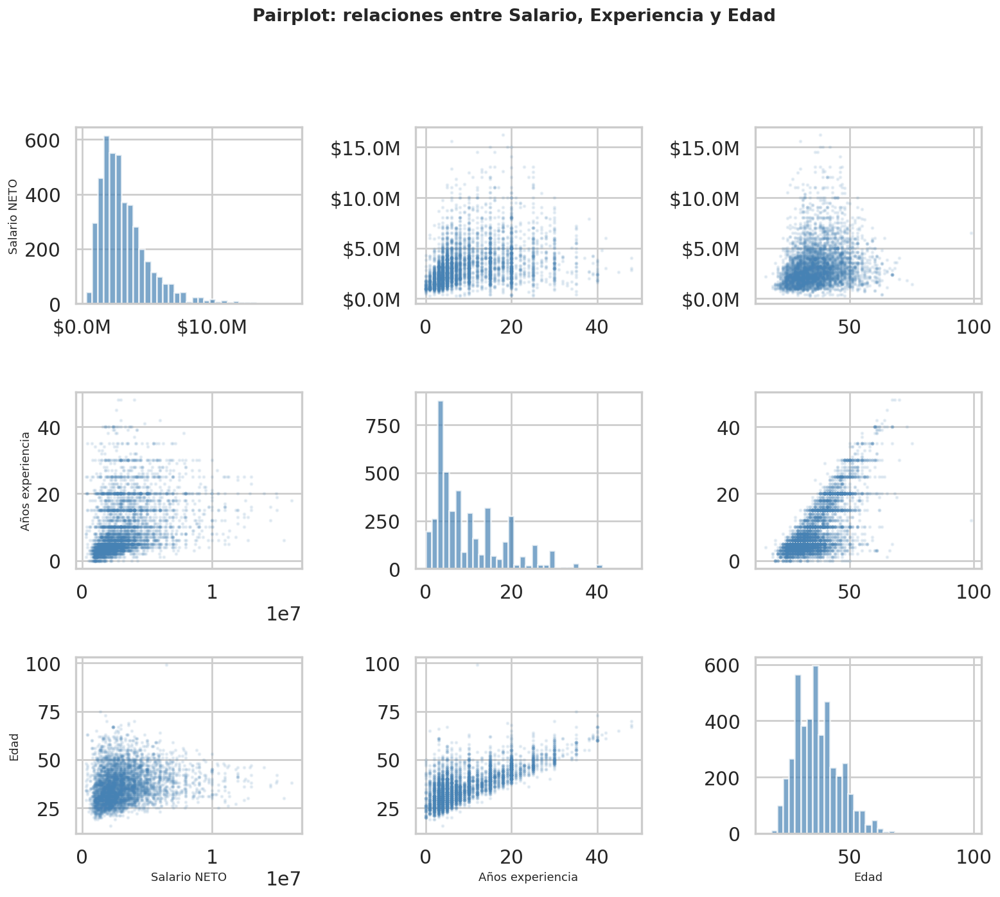
*Fig. 8.2 — Pairplot (matriz de dispersión) de tres variables numéricas. La diagonal muestra los histogramas individuales. Las celdas fuera de la diagonal muestran la relación bivariada. Se observa asociación positiva entre experiencia y edad, y entre experiencia y salario.*

### 8.4 Heatmap de correlación

**¿Qué es?** Una representación visual de la **matriz de correlación** usando colores.

**Lectura:**
- Rojo/cálido = correlación positiva fuerte.
- Azul/frío = correlación negativa fuerte.
- Blanco/neutro = correlación cercana a 0.
- `annot=True` muestra los valores numéricos en cada celda.

**Utilidad:** identificar rápidamente qué pares de variables están más correlacionados.

```python
sns.heatmap(df[num_cols].corr(), annot=True, cmap='coolwarm', center=0)
```

### 8.5 Boxplot facetado

**¿Qué es?** Un boxplot donde se cruzan **dos variables categóricas** (una en el eje, otra como hue).

**Ejemplo:** Boxplot de salario por seniority, con hue por género.

```python
sns.boxplot(data=df, x='work_seniority', y='salary_monthly_NETO', 
            hue='profile_gender', order=['Junior', 'Semi-Senior', 'Senior'])
```

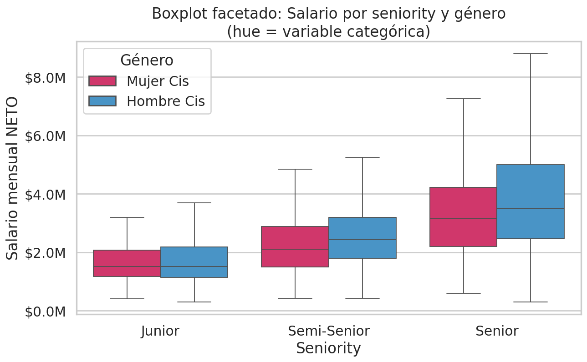
*Fig. 8.3 — Boxplot facetado: salario por seniority con hue por género. Permite observar si la brecha salarial de género existe y si varía según el nivel de seniority. Cada par de cajas compara hombres (azul) y mujeres (rosa) dentro del mismo nivel.*

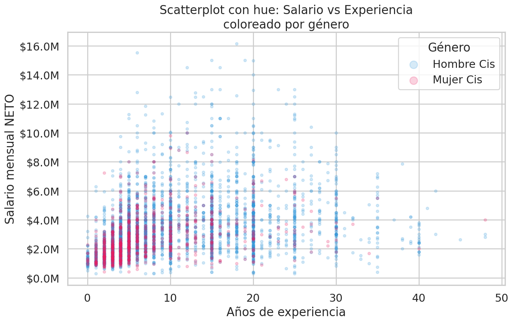
*Fig. 8.4 — Scatterplot de salario vs experiencia, coloreado por género. Las distribuciones se superponen considerablemente, pero podrían existir diferencias sutiles que requieran análisis estadístico formal.*

**¿Qué muestra?** Si el efecto de una variable categórica (seniority) sobre el salario **cambia** según otra variable categórica (género). Por ejemplo: ¿la brecha salarial de género existe en todos los niveles de seniority o solo en algunos?

---

## 9. Formulación de hipótesis y abordaje

El enunciado pide explícitamente: "Plantear preguntas, hipótesis y diseñar un abordaje."

### 9.1 Pregunta de investigación

Una buena pregunta de investigación es:
- **Específica:** no "¿qué pasa con los salarios?" sino "¿los programadores de Go ganan más que los de PHP, controlando por seniority?"
- **Medible:** se puede responder con los datos disponibles.
- **Relevante:** aporta información útil.

### 9.2 Hipótesis

Una **hipótesis** es una afirmación tentativa que se puede contrastar con datos.

**Estructura:**
- **H₀ (hipótesis nula):** "No hay diferencia" / "No hay efecto" / "Las variables son independientes".
- **H₁ (hipótesis alternativa):** "Sí hay diferencia" / "Sí hay efecto".

**Para este entregable** no se pide hacer tests formales (eso es Parte 2), pero sí plantear hipótesis que los datos sugieran.

**Ejemplos:**
- H₁: "Los lenguajes de backend/infraestructura (Go, Kotlin) están asociados a salarios mayores que los de frontend (HTML, CSS)."
- H₁: "La experiencia tiene mayor efecto sobre el salario que el lenguaje de programación."
- H₁: "Existe brecha salarial de género que persiste al controlar por seniority."

### 9.3 Diseño del abordaje analítico

El **abordaje** es el plan para contrastar las hipótesis. Incluye:

1. **Variables a analizar:** ¿cuáles y por qué?
2. **Sub-población:** ¿qué filtros y por qué?
3. **Métricas:** ¿qué medidas o probabilidades calcular?
4. **Visualizaciones:** ¿qué gráficos producir?
5. **Iteraciones:** si los resultados iniciales no son concluyentes, ¿qué ajustar?

**El enunciado lo dice explícitamente:**

> "Si encuentran que las distribuciones de los lenguajes de programación que seleccionaron inicialmente no son muy diferentes, pueden re-hacer el análisis usando sólo los lenguajes de programación que son diferentes."

Esto es un proceso iterativo. No se espera que el primer intento sea perfecto.

---

## Resumen: ¿Qué concepto va en qué ejercicio?

| Concepto | Ej.1 | 2a | 2b | 2c | 2d |
|----------|:----:|:--:|:--:|:--:|:--:|
| Medidas de centralización (media, mediana) | ✅ | | | ✅ | |
| Medidas de dispersión (desvío, IQR) | ✅ | | | ✅ | |
| Cuantiles y percentiles | ✅ | | | | |
| Detección de outliers (IQR) | ✅ | | | | |
| Histograma | ✅ | | | ✅ | |
| Boxplot comparativo | ✅ | ✅ | | ✅ | |
| Violin plot | ✅ | | | | |
| Probabilidad condicional | ✅ | | | | |
| Scatterplot | | ✅ | ✅ | | ✅ |
| Covarianza y correlación (Pearson/Spearman) | | | ✅ | | |
| Matriz de correlación / heatmap | | | ✅ | | |
| Densidad conjunta | | ✅ | | | ✅ |
| Densidad condicional | | | | ✅ | |
| Independencia estadística | | | | ✅ | |
| Scatterplot con hue | | ✅ | | | ✅ |
| Pairplot | | ✅ | | | |
| Boxplot facetado (hue) | | ✅ | | | |
| Variables confusoras | ✅ | | | | |
| Formulación de hipótesis | ✅ | ✅ | ✅ | ✅ | ✅ |
