# 📖 Guía teórica — Entregable AyVD Parte 2

> Todos los conceptos estadísticos y metodológicos necesarios para resolver
> los Ejercicios 1, 2 y 3 del entregable parte 2, explicados en profundidad.

## 📚 Material de referencia del curso

Las 4 filminas de las clases 3 y 4, que corresponden a esta parte del entregable, están mirrorizadas localmente en [`_site/filminas/`](../../../_site/filminas/README.md):

| Clase | Filmina | Archivo local | Cubre |
|---|---|---|---|
| **3** — Estadísticos y Estadística | Muestreo aleatorio, LGN, TCL, estadística inferencial | [`clase3_estadisticos_y_estadistica.pdf`](../../../_site/filminas/clase3_estadisticos_y_estadistica.pdf) | Secciones 1, 1.3 |
| **3** — Estimación | Estimadores puntuales, sesgo, precisión, IC, método del pivote | [`clase3_estimacion.pdf`](../../../_site/filminas/clase3_estimacion.pdf) | Secciones 1.5, 2 |
| **4** — Test de Hipótesis | H0, H1, errores I y II, p-valor, test t y Welch, Chi² | [`clase4_test_de_hipotesis.pdf`](../../../_site/filminas/clase4_test_de_hipotesis.pdf) | Secciones 3, 4 |
| **4** — Visualización y Comunicación | Principios, encodings, sesgos de percepción, Tufte | [`clase4_visualizacion_y_comunicacion.pdf`](../../../_site/filminas/clase4_visualizacion_y_comunicacion.pdf) | Sección 5 |

Toda la guía se apoya en estas 4 filminas. Las referencias específicas a una filmina aparecen marcadas con el símbolo 📘 en cada sección relevante.

---

## Índice

1. [Población, muestra y estimadores](#1-población-muestra-y-estimadores)
   - 1.1 Parámetro vs estimador
   - 1.2 Distribución muestral
   - 1.3 Ley de los Grandes Números (LGN)
   - 1.4 Teorema Central del Límite (TCL)
   - 1.5 Error estándar
   - 1.6 Propiedades de los estimadores (sesgo, precisión)
2. [Estimación puntual e intervalar](#2-estimación-puntual-e-intervalar)
   - 2.1 Estimación puntual
   - 2.2 Intervalo de confianza
   - 2.3 Método del pivote
   - 2.4 IC para la media
   - 2.5 IC para la diferencia de medias (apareadas, independientes, Welch)
   - 2.6 IC para la varianza (Chi²)
   - 2.7 Interpretación correcta del IC
3. [Test de hipótesis](#3-test-de-hipótesis)
   - 3.1 Componentes del test
   - 3.2 Hipótesis nula y alternativa
   - 3.3 Estadístico de prueba (pivote)
   - 3.4 Región de rechazo y valor crítico
   - 3.5 P-valor
   - 3.6 Decisión e interpretación
   - 3.7 Test t de Student
   - 3.8 Test de Welch
   - 3.9 Z-test para proporciones
   - 3.10 Test Chi² para independencia de categóricas
   - **3.11 Tests no paramétricos para diferencia entre grupos** *(nuevo)*
     - 3.11.a Mann-Whitney U (2 grupos, no paramétrico)
     - 3.11.b ANOVA de un factor (k > 2 grupos, paramétrico)
     - 3.11.c Kruskal-Wallis (k > 2 grupos, no paramétrico)
     - 3.11.d Tests omnibus y tests post-hoc
     - 3.11.e Mapa: paramétrico ↔ no paramétrico
4. [Errores y potencia del test](#4-errores-y-potencia-del-test)
   - 4.1 Error Tipo I (α)
   - 4.2 Error Tipo II (β)
   - 4.3 Potencia del test (1 - β)
   - 4.4 Tamaño del efecto (effect size)
   - 4.5 Tamaño de muestra necesario
5. [Comunicación y visualización de resultados](#5-comunicación-y-visualización-de-resultados)
   - 5.1 Principios de comunicación efectiva
   - 5.2 Sesgos cognitivos del observador
   - 5.3 Ranking de encodings visuales (Cleveland-McGill)
   - 5.4 Elegir la visualización adecuada
   - 5.5 Principio de Tufte (proporción tinta/datos)
   - 5.6 Adaptar al público objetivo
   - 5.7 Las tres audiencias del entregable
6. [Mapa de conceptos por ejercicio](#6-mapa-de-conceptos-por-ejercicio)
7. [Lecturas recomendadas](#7-lecturas-recomendadas)

---

## 1. Población, muestra y estimadores

### 1.1 Parámetro vs estimador

| Concepto | Definición | Ejemplo |
|----------|-----------|---------|
| **Parámetro** (θ) | Valor verdadero de la población (desconocido, fijo) | μ = salario promedio real de TODOS los trabajadores IT de Argentina |
| **Estimador** (θ̂) | Función de los datos muestrales que se usa para aproximar θ | x̄ = salario promedio de los 4.939 encuestados |
| **Estimación** | El valor numérico concreto que produce el estimador | x̄ = $2.403.162 |

El estimador es una **variable aleatoria** (cambia con cada muestra), mientras que el parámetro es un valor fijo que queremos conocer pero no podemos observar directamente.

### 1.2 Distribución muestral

Si tomáramos muchas muestras de la misma población y calculáramos la media de cada una, obtendríamos una **distribución de medias muestrales**. Esta distribución tiene propiedades conocidas que son la base de toda la inferencia estadística.

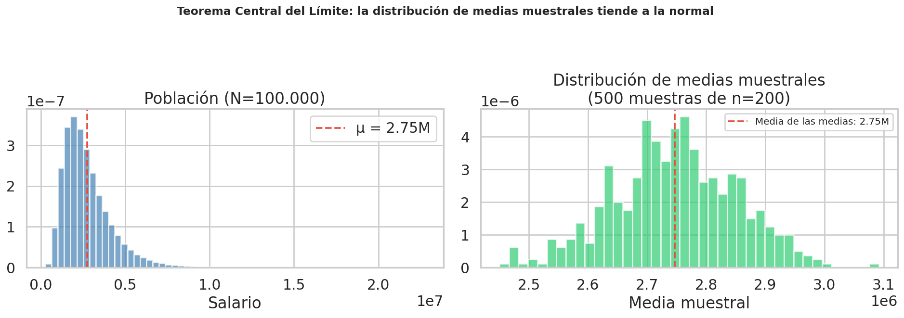
*Fig. 1.1 — Izquierda: distribución de la población (asimétrica). Derecha: distribución de las medias muestrales de 500 muestras de n=200. A pesar de que la población no es normal, la distribución de medias se aproxima a una campana de Gauss (TCL).*

### 1.3 Ley de los Grandes Números (LGN)

📘 *Filmina: clase 3 — Estadísticos y Estadística.*

La LGN establece que cuando el tamaño de muestra crece, la **media muestral converge a la media poblacional**:

$$\bar{X}_n = \frac{1}{n}\sum_{i=1}^{n} X_i \xrightarrow{n \to \infty} \mu$$

Formalmente: dada una muestra aleatoria `X₁, X₂, ..., Xₙ` (clones i.i.d. de una misma variable con media `μ`), la media muestral converge en probabilidad al parámetro poblacional `μ`.

**Importancia:**
- Garantiza que, con muestras "suficientemente grandes", la media muestral es una buena aproximación de la media verdadera.
- Es la base conceptual de la estimación puntual por media muestral: usamos `x̄` para estimar `μ` porque la LGN asegura que con `n` creciente el error tiende a cero.
- **No dice nada sobre la forma** de la distribución de `x̄` para un `n` finito — eso lo aporta el TCL (sección siguiente).

La LGN y el TCL son dos resultados complementarios: la LGN dice **hacia dónde converge** la media muestral (a `μ`), y el TCL dice **cómo es la forma de la distribución** de la media muestral (aproximadamente normal) para `n` grande.

### 1.4 Teorema Central del Límite (TCL)

📘 *Filmina: clase 3 — Estadísticos y Estadística.*

El TCL es uno de los teoremas más importantes de la estadística:

> **Si X₁, X₂, ..., Xₙ son variables aleatorias independientes e idénticamente distribuidas con media μ y varianza σ², entonces la distribución de la media muestral x̄ se aproxima a una normal a medida que n crece:**

$$\bar{X} \xrightarrow{d} N\left(\mu, \frac{\sigma^2}{n}\right)$$

**¿Por qué importa?**
- No importa la forma de la distribución original (puede ser asimétrica, bimodal, etc.).
- Con n suficientemente grande (en la práctica, n ≥ 30 suele ser suficiente), la distribución de x̄ es aproximadamente normal.
- Esto nos permite construir intervalos de confianza y hacer tests de hipótesis **sin asumir normalidad de los datos originales**.

La filmina lo ilustra con dos casos: la distribución uniforme y la exponencial, mostrando cómo la densidad de la media muestral *"crece en altura y decrece en dispersión si n crece"* y se vuelve acampanada aunque la población original no lo sea.

### 1.5 Error estándar

El **error estándar** (SE) mide cuánto varía el estimador de muestra en muestra:

$$SE(\bar{X}) = \frac{s}{\sqrt{n}}$$

- **s** = desvío estándar de la muestra
- **n** = tamaño de la muestra
- A mayor n → menor SE → estimaciones más precisas
- A mayor variabilidad (s) → mayor SE → estimaciones menos precisas

**En Python:** `se = df['salary_monthly_NETO'].std() / np.sqrt(len(df))`

### 1.6 Propiedades de los estimadores (sesgo, precisión)

📘 *Filmina: clase 3 — Estimación.*

Un buen estimador debe ser:

| Propiedad | Significado | ¿La media muestral lo cumple? |
|-----------|-------------|:----:|
| **Insesgado** | En promedio, acierta al parámetro real. E(θ̂) = θ | ✅ Sí |
| **Consistente** | Se acerca al parámetro real al aumentar n (LGN) | ✅ Sí |
| **Eficiente** | Tiene la menor varianza posible entre los estimadores insesgados | ✅ Sí (bajo normalidad) |

**Terminología clave** (directamente de la filmina):

- **Sesgo ⇔ Exactitud:** un estimador es exacto si su valor esperado `E(θ̂)` coincide con `θ`. Un estimador insesgado es aquel cuyo sesgo es cero.
- **Varianza ⇔ Precisión:** un estimador es preciso si su varianza es baja — es decir, sus valores varían poco entre muestras. Un estimador es *más eficiente que otro* si tiene menor varianza.

Un estimador puede ser:

| Exacto (sin sesgo) | Preciso (baja varianza) | Lectura |
|:--:|:--:|---|
| ✅ | ✅ | **Insesgado y eficiente** — ideal |
| ✅ | ❌ | Insesgado pero disperso, necesita `n` grande |
| ❌ | ✅ | Preciso pero sistemáticamente corrido — peligroso |
| ❌ | ❌ | No sirve |

La media muestral `x̄` es el ejemplo canónico de estimador **insesgado y eficiente** de `μ` bajo condiciones razonables.

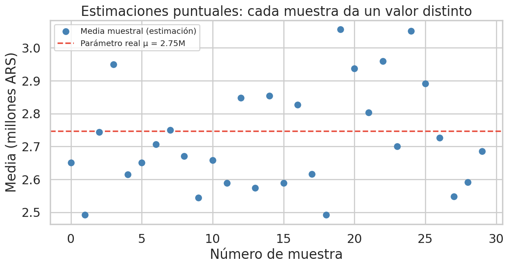
*Fig. 1.2 — 30 muestras distintas de la misma población. Cada punto azul es la media de una muestra (estimación puntual). La línea roja es el parámetro real μ. Las estimaciones fluctúan alrededor del valor verdadero: el estimador es insesgado pero impreciso.*

---

## 2. Estimación puntual e intervalar

### 2.1 Estimación puntual

Es dar **un solo número** como aproximación del parámetro.

**Ejemplo del entregable:** La estimación puntual de la diferencia de medias salariales entre varones y mujeres es:

$$\hat{\Delta} = \bar{X}_A - \bar{X}_B$$

Un solo número que resume la brecha, pero **no dice nada sobre la incertidumbre** de esa estimación.

### 2.2 Intervalo de confianza (IC)

📘 *Filmina: clase 3 — Estimación.*

En vez de un solo número, damos un **rango de valores plausibles** para el parámetro, acompañado de un nivel de confianza.

**Estructura general:**

$$IC = \hat{\theta} \pm z_{\alpha/2} \cdot SE(\hat{\theta})$$

Donde:
- θ̂ = estimación puntual
- z_{α/2} = valor crítico de la distribución normal (1.96 para 95%)
- SE = error estándar del estimador

Un intervalo de confianza es un **intervalo aleatorio**: sus extremos son estadísticos `I(X₁,...,Xₙ)` y `S(X₁,...,Xₙ)` calculados sobre la muestra, y por lo tanto cambian con cada muestra. El **nivel de confianza `1 − α`** (habitualmente 95%) es la probabilidad de que el intervalo construido contenga al parámetro verdadero, calculada sobre la distribución de todas las muestras posibles.

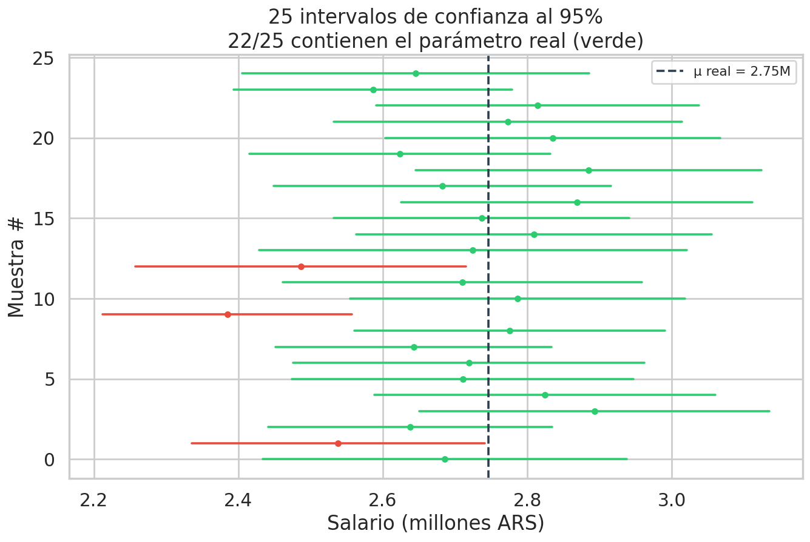
*Fig. 2.1 — 25 intervalos de confianza al 95% construidos a partir de 25 muestras distintas. Los intervalos en verde contienen el parámetro real (línea punteada); los rojos no. En promedio, el 95% de los intervalos contienen el valor verdadero.*

### 2.3 Método del pivote

📘 *Filmina: clase 3 — Estimación (muy enfatizado).*

El método del pivote es la técnica general para construir intervalos de confianza. Se basa en encontrar una **función pivote** `Q(X₁,...,Xₙ, θ)` que:

1. Depende de los datos y del parámetro `θ` a estimar.
2. Tiene una **distribución conocida que NO depende de θ** (por ejemplo, `N(0,1)`, `t_n−1`, `χ²_n−1`).

**Pasos:**

1. **Identificar el pivote** adecuado según el caso (ver tabla abajo).
2. **Establecer el intervalo** de valores del pivote que tienen probabilidad `1 − α` bajo su distribución conocida (por ejemplo, `P(-z_{α/2} ≤ Z ≤ z_{α/2}) = 1 − α`).
3. **Despejar el parámetro** dentro de la desigualdad, dejando `θ` solo en el medio. Los extremos del intervalo quedan en términos de estadísticos calculables sobre la muestra.

**Pivotes más usados (de las filminas):**

| Caso | Pivote | Distribución |
|---|---|---|
| Media de normal, σ² conocida | `(x̄ − μ) / (σ/√n)` | `N(0,1)` |
| Media, n grande, σ² desconocida | `(x̄ − μ) / (s/√n)` | `N(0,1)` (asintótico por TCL) |
| Media de normal, σ² desconocida, n chica | `(x̄ − μ) / (s/√n)` | `t_{n−1}` (Student) |
| Varianza de normal | `(n−1)·s² / σ²` | `χ²_{n−1}` |
| Diferencia de medias, varianzas iguales desconocidas | pivote `t` con varianza combinada | `t_{n₁+n₂−2}` |
| Diferencia de medias, varianzas distintas (Welch) | pivote `t` con ajuste Welch-Satterthwaite | `t_ν` (ν aproximado) |

Este es el **marco teórico único** bajo el cual se construyen todos los ICs concretos de las secciones siguientes.

### 2.4 IC para la media

📘 *Filmina: clase 3 — Estimación (ejemplo desarrollado).*

**Caso 1 — σ² conocida:**

$$IC_{1-\alpha}(\mu) = \bar{x} \pm z_{\alpha/2} \cdot \frac{\sigma}{\sqrt{n}}$$

Pivote: `(x̄ − μ) / (σ/√n) ~ N(0,1)`. Este es el caso más simple y casi nunca se cumple en la práctica (uno raramente conoce σ² antes de medirla), pero sirve como punto de partida.

**Caso 2 — σ² desconocida, n grande (asintótico por TCL):**

$$IC_{1-\alpha}(\mu) \approx \bar{x} \pm z_{\alpha/2} \cdot \frac{s}{\sqrt{n}}$$

Para α = 0.05 (confianza 95%): `z_{0.025} = 1.96`. Se reemplaza σ por el desvío muestral `s`, aprovechando que el TCL garantiza aproximación normal.

**Caso 3 — σ² desconocida, n chica, población normal:**

$$IC_{1-\alpha}(\mu) = \bar{x} \pm t_{n-1, \alpha/2} \cdot \frac{s}{\sqrt{n}}$$

Pivote: `(x̄ − μ) / (s/√n) ~ t_{n−1}`. Se usa la distribución `t` de Student con `n−1` grados de libertad porque ahora estamos estimando dos cosas simultáneamente (`μ` y `σ²`), lo que introduce incertidumbre adicional. Para `n` grande, `t_{n−1} → N(0,1)` y el caso 3 converge al caso 2.

**En Python:**
```python
from scipy import stats
mean = data.mean()
se = data.std(ddof=1) / np.sqrt(len(data))
# Caso 2 (asintótico):
ci_low  = mean - 1.96 * se
ci_high = mean + 1.96 * se
# Caso 3 (exacto con t):
t_crit = stats.t.ppf(0.975, df=len(data)-1)
ci_low  = mean - t_crit * se
ci_high = mean + t_crit * se
```

### 2.5 IC para la diferencia de medias

📘 *Filmina: clase 3 — Estimación.*

Este es el IC que pide el **Ejercicio 1** del entregable.

#### Muestras apareadas

Cuando cada observación `X_i` tiene su par natural `Y_i` (por ejemplo, BRUTO y NETO de la misma persona), se trabaja con la variable diferencia `Z_i = X_i − Y_i`:

$$Z_1, Z_2, \ldots, Z_n \sim \text{m.a. de } N(\mu_1 - \mu_2, \sigma_1^2 + \sigma_2^2 - 2\rho\sigma_1\sigma_2)$$

Y se construye el IC de `μ_Z = μ_1 − μ_2` como un IC de media ordinario sobre las `Z_i`.

> **📘 Ejemplo literal de la filmina de clase 3:** *"como el caso de Z = BRUTO − NETO. Z(i) = BRUTO(persona i) − NETO(persona i) para cada persona i."*
>
> Esto conecta directamente con la columna derivada `DESCUENTOS = BRUTO − NETO` que usamos en el ejercicio 2b de la parte 1 (descriptivo). En la parte 2 se puede construir un IC para el descuento medio poblacional a partir de esa misma columna.

#### Muestras independientes, igual varianza desconocida

$$IC_{1-\alpha}(\mu_A - \mu_B) = (\bar{X}_A - \bar{X}_B) \pm t_{n_A + n_B - 2, \alpha/2} \cdot s_p \sqrt{\frac{1}{n_A} + \frac{1}{n_B}}$$

Donde `s_p²` es la varianza combinada (pooled):

$$s_p^2 = \frac{(n_A - 1)s_A^2 + (n_B - 1)s_B^2}{n_A + n_B - 2}$$

#### Muestras independientes, varianzas distintas (Welch)

$$IC_{1-\alpha}(\mu_A - \mu_B) = (\bar{X}_A - \bar{X}_B) \pm t_{\nu, \alpha/2} \cdot \sqrt{\frac{s_A^2}{n_A} + \frac{s_B^2}{n_B}}$$

Con grados de libertad `ν` calculados mediante la aproximación de **Welch-Satterthwaite**. Es el caso más general y el recomendado por defecto cuando no se puede asumir igualdad de varianzas.

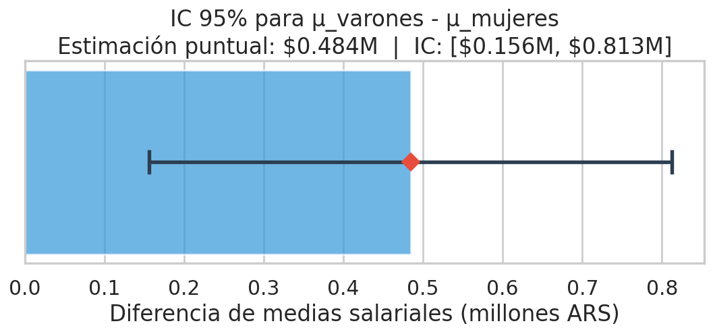
*Fig. 2.2 — Intervalo de confianza al 95% para la diferencia de medias salariales entre varones y mujeres. El rombo rojo es la estimación puntual. Si el IC no cruza el cero (línea gris), podemos decir que la diferencia es estadísticamente significativa.*

### 2.6 IC para la varianza (Chi²)

📘 *Filmina: clase 3 — Estimación.*

Para construir un IC de la varianza poblacional `σ²` de una población normal se usa el pivote:

$$\frac{(n-1) \cdot s^2}{\sigma^2} \sim \chi^2_{n-1}$$

Despejando:

$$IC_{1-\alpha}(\sigma^2) = \left[ \frac{(n-1)s^2}{\chi^2_{n-1, 1-\alpha/2}},  \frac{(n-1)s^2}{\chi^2_{n-1, \alpha/2}} \right]$$

Este IC es **asimétrico** (porque la distribución Chi² lo es) y aparece típicamente cuando se quiere controlar la variabilidad de un proceso, no su valor central. La filmina lo ilustra con el ejemplo de una máquina de llenado de botellas donde se requiere `σ < 0,15` onzas para asegurar uniformidad.

### 2.7 Interpretación correcta del IC

| Interpretación | ¿Correcta? |
|---------------|:-----------:|
| "Hay un 95% de probabilidad de que μ esté dentro de este intervalo" | ❌ **Incorrecta** |
| "Si repitiéramos el muestreo muchas veces, el 95% de los intervalos construidos contendrían μ" | ✅ **Correcta** |

El parámetro μ es fijo (no es aleatorio). Lo que varía es el intervalo (porque depende de la muestra). Un IC concreto o contiene a μ o no lo contiene; no hay "probabilidad" de que lo contenga.

**Relación con el test de hipótesis:**
- Si el IC para μ_A - μ_B **no contiene el 0** → rechazamos H₀: μ_A = μ_B
- Si el IC **contiene el 0** → no rechazamos H₀
- Esto es **equivalente** a hacer un test bilateral al mismo nivel α

---

## 3. Test de hipótesis

### 3.1 Componentes del test

Un test de hipótesis es un procedimiento formal para decidir, a partir de datos muestrales, si una afirmación sobre la población es plausible o no.

**Componentes:**
1. **Hipótesis** (H₀ y H₁)
2. **Estadístico de prueba** (pivote)
3. **Distribución bajo H₀**
4. **Regla de decisión** (valor crítico o p-valor)
5. **Nivel de significancia** (α)

### 3.2 Hipótesis nula y alternativa

| Hipótesis | Notación | Significado | En el entregable |
|-----------|----------|-------------|------------------|
| **Nula** | H₀ | "No hay efecto/diferencia" | H₀: μ_varones = μ_mujeres (no hay brecha salarial) |
| **Alternativa** | H₁ | "Sí hay efecto/diferencia" | H₁: μ_varones ≠ μ_mujeres (sí hay brecha) |

**Tipos de test según H₁:**

| Tipo | H₁ | Uso |
|------|-----|-----|
| **Bilateral** | μ_A ≠ μ_B | Cuando no sabemos la dirección de la diferencia |
| **Unilateral derecho** | μ_A > μ_B | Cuando sospechamos que A es mayor |
| **Unilateral izquierdo** | μ_A < μ_B | Cuando sospechamos que A es menor |

En el entregable se usa un **test bilateral** (no asumimos de antemano quién gana más).

### 3.3 Estadístico de prueba (pivote)

Es una función de los datos que resume la evidencia contra H₀. Para comparar dos medias, el estadístico t es:

$$t = \frac{\bar{X}_A - \bar{X}_B}{SE_{diff}} = \frac{\bar{X}_A - \bar{X}_B}{\sqrt{\frac{s_A^2}{n_A} + \frac{s_B^2}{n_B}}}$$

**Distribución bajo H₀:** Si H₀ es verdadera (no hay diferencia), el estadístico t sigue una distribución t de Student (que se aproxima a la normal para muestras grandes).

### 3.4 Región de rechazo y valor crítico

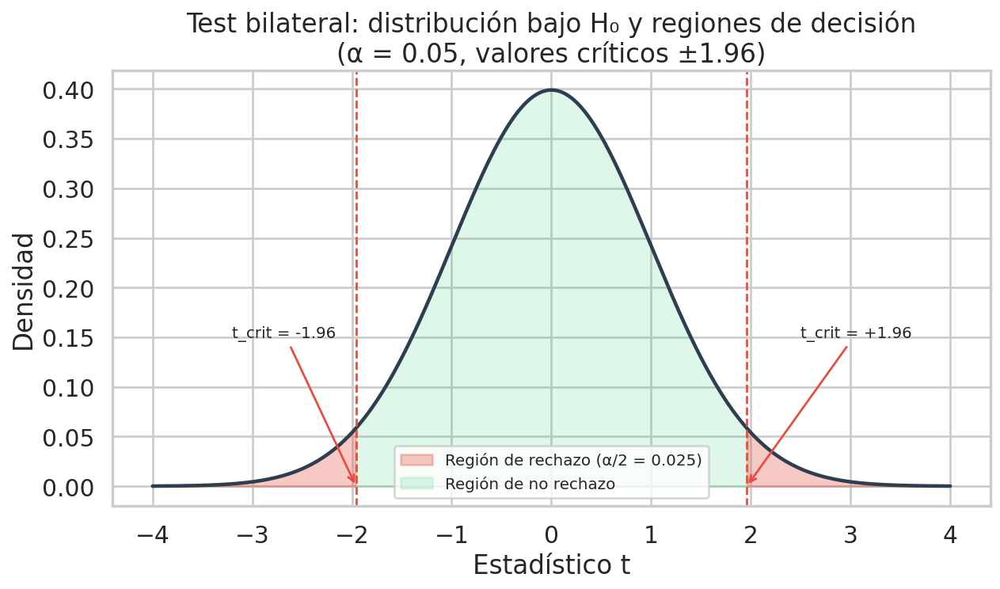
*Fig. 3.1 — Distribución del estadístico bajo H₀. Las zonas rojas son las regiones de rechazo (α/2 = 2.5% en cada cola). Si el estadístico calculado cae en la zona roja, rechazamos H₀. Los valores críticos ±1.96 delimitan las regiones.*

**Regla de decisión:**
- Si |t_obs| > t_crit → **rechazamos H₀**
- Si |t_obs| ≤ t_crit → **no rechazamos H₀**

### 3.5 P-valor

El **p-valor** es la probabilidad de obtener un estadístico **tan o más extremo** que el observado, **asumiendo que H₀ es verdadera**.

$$p = P(|T| \geq |t_{obs}| \mid H_0)$$

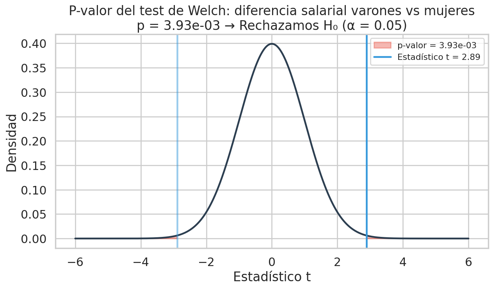
*Fig. 3.2 — El p-valor (áreas rojas) representa la probabilidad de obtener un resultado tan extremo o más bajo H₀. Cuanto menor es el p-valor, más evidencia contra H₀. La línea azul es el estadístico observado.*

**Interpretación:**
| P-valor | Interpretación |
|---------|---------------|
| p < 0.001 | Evidencia muy fuerte contra H₀ |
| p < 0.01 | Evidencia fuerte contra H₀ |
| p < 0.05 | Evidencia moderada contra H₀ |
| p ≥ 0.05 | Evidencia insuficiente para rechazar H₀ |

**Cuidado con el p-valor:**
- p < 0.05 **NO significa** que H₀ es falsa con 95% de certeza.
- p < 0.05 **NO significa** que el efecto es grande o importante.
- Un p-valor pequeño solo dice que el resultado es **poco probable bajo H₀**, no que H₁ sea verdadera.

### 3.6 Decisión e interpretación

| Resultado | Decisión | Redacción |
|-----------|----------|-----------|
| p < α | Rechazamos H₀ | "Hay evidencia estadísticamente significativa de que existe diferencia entre las medias (p = X)" |
| p ≥ α | No rechazamos H₀ | "No hay evidencia suficiente para afirmar que existe diferencia (p = X)" |

**Nota:** "No rechazar H₀" ≠ "H₀ es verdadera". Simplemente no tenemos evidencia suficiente para descartarla.

### 3.7 Test t de Student (varianzas iguales)

Asume que ambos grupos tienen la **misma varianza** (σ²_A = σ²_B).

$$t = \frac{\bar{X}_A - \bar{X}_B}{s_p \sqrt{\frac{1}{n_A} + \frac{1}{n_B}}}$$

Donde s_p es la varianza combinada (pooled):

$$s_p^2 = \frac{(n_A - 1)s_A^2 + (n_B - 1)s_B^2}{n_A + n_B - 2}$$

**En Python:** `stats.ttest_ind(groupA, groupB, equal_var=True)`

### 3.8 Test de Welch (varianzas distintas)

**No** asume varianzas iguales. Es más robusto y **recomendado por defecto**.

$$t = \frac{\bar{X}_A - \bar{X}_B}{\sqrt{\frac{s_A^2}{n_A} + \frac{s_B^2}{n_B}}}$$

Los grados de libertad se calculan con la aproximación de Welch-Satterthwaite (fórmula compleja, scipy lo hace automáticamente).

**En Python:** `stats.ttest_ind(groupA, groupB, equal_var=False)`

**¿Cuándo usar cada uno?**

| Situación | Usar |
|-----------|------|
| Varianzas similares, mismos tamaños de muestra | Student o Welch (dan resultados similares) |
| Varianzas distintas o tamaños de muestra diferentes | **Welch** (siempre más seguro) |
| Duda | **Welch** (es la recomendación general moderna) |

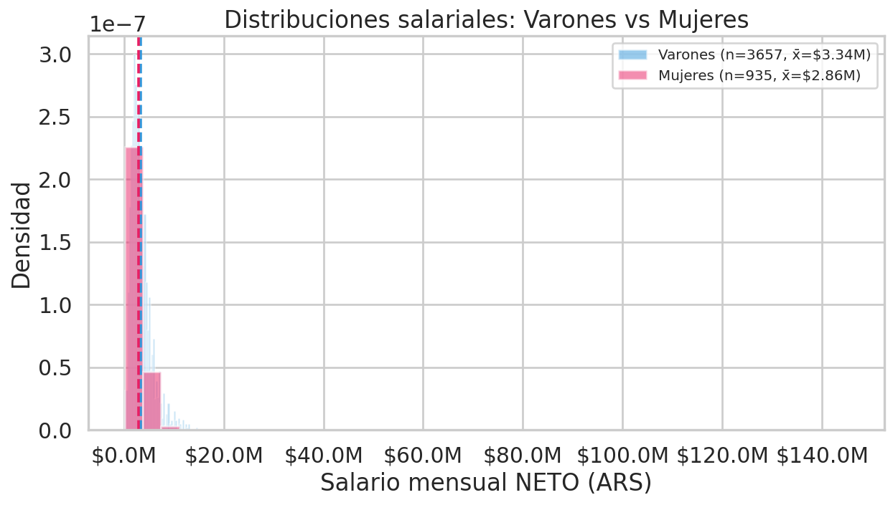
*Fig. 3.3 — Histogramas superpuestos de salarios de varones (azul) y mujeres (rosa) del dataset. Las líneas punteadas marcan las medias de cada grupo. La separación visual sugiere una diferencia, pero el test formal cuantifica si es estadísticamente significativa.*

### 3.9 Z-test para proporciones

📘 *Filmina: clase 4 — Test de Hipótesis.*

Cuando la variable de interés es una proporción (fracción de éxitos `p` en `n` ensayos), el estadístico de prueba es:

$$Z_{obs} = \frac{\hat{p} - p_0}{\sqrt{\frac{p_0(1 - p_0)}{n}}}$$

Donde:
- `p̂` = proporción muestral observada
- `p_0` = proporción hipotética bajo H₀
- `n` = tamaño de muestra

**Supuestos (rule of thumb):** `n > 30`, `n·p_0 ≥ 5` y `n·(1−p_0) ≥ 5`. Bajo estos supuestos la aproximación normal es razonable.

**Test bilateral:** se rechaza H₀ si `|Z_obs| > z_{α/2}`, con p-valor `P(|Z| > |z_obs|)`.
**Test unilateral (cola derecha):** se rechaza H₀ si `Z_obs > z_α`, con p-valor `P(Z > z_obs)`.

**En Python:**
```python
from statsmodels.stats.proportion import proportions_ztest
stat, pval = proportions_ztest(count=exitos, nobs=n, value=p0, alternative='two-sided')
```

### 3.10 Test Chi² para independencia de variables categóricas

📘 *Filmina: clase 4 — Test de Hipótesis.*

Cuando las dos variables en estudio son **categóricas**, no se puede aplicar un test de medias. El test apropiado es **Chi-cuadrado de independencia**, basado en una tabla de contingencia.

**Hipótesis:**
- **H₀:** las dos variables son independientes.
- **H₁:** las dos variables están relacionadas (no son independientes).

**Procedimiento:**

1. Construir la **tabla de contingencia** con las frecuencias observadas `f_o(i,j)` — cantidad de casos que caen en cada celda `(i, j)`.
2. Calcular las **frecuencias esperadas bajo independencia**:
   $$f_e(i,j) = \frac{(\text{total fila } i) \cdot (\text{total col } j)}{\text{total general}}$$
3. Calcular el estadístico Chi²:
   $$\chi^2 = \sum_{i,j} \frac{(f_o(i,j) - f_e(i,j))^2}{f_e(i,j)}$$
4. Comparar contra la distribución `χ²` con `(filas − 1) × (columnas − 1)` grados de libertad.
5. Si `χ²_obs > χ²_{crit}` (o p-valor < α) → rechazar H₀.

**Relación con el ejercicio 2c de la parte 1:** en parte 1 se usó un abordaje **descriptivo** para la independencia entre nivel de estudio y sueldo (comparar `P(A|B) vs P(A)` sin test). En parte 2, con el test Chi², la misma pregunta se puede responder con una decisión formal y un p-valor.

> La filmina usa el ejemplo de 4 tratamientos médicos × 3 respuestas (peor, igual, mejor) para ilustrar el cálculo. Aplicado al dataset sysarmy, podríamos testear si `work_seniority` y `profile_gender` son independientes a partir de la tabla de contingencia 3 × K.

**En Python:**
```python
from scipy.stats import chi2_contingency
contingencia = pd.crosstab(df['work_seniority'], df['profile_gender'])
chi2, pval, dof, expected = chi2_contingency(contingencia)
```

### 3.11 Tests no paramétricos para diferencia entre grupos

Los tests t (Student y Welch) **asumen normalidad** del estadístico (vía el TCL para muestras grandes, o vía la distribución de los datos para muestras chicas). Cuando esa normalidad es dudosa —por ejemplo en distribuciones de ingresos, donde la asimetría a la derecha es marcada— conviene complementar el resultado con un test que **no dependa de ese supuesto**. Esos son los tests no paramétricos basados en **rangos**.

#### 3.11.a Test de Mann-Whitney U *(2 grupos)*

Es la contraparte no paramétrica del test t de dos muestras independientes.

- **No asume normalidad.** Funciona transformando todos los valores observados a sus rangos en la muestra combinada y contrastando si los rangos están sistemáticamente más altos en un grupo que en el otro.
- **Hipótesis (forma estricta):** $H_0$: las distribuciones de los dos grupos son iguales (estocásticamente). $H_1$: una distribución es estocásticamente mayor que la otra.
- **Hipótesis (interpretación más usada):** bajo el supuesto adicional de que las distribuciones tienen la misma forma, $H_0$ se interpreta como igualdad de **medianas** (es como lo presenta el docente en el notebook 05).
- **Estadístico U:**

$$U_1 = n_1 n_2 + \frac{n_1(n_1+1)}{2} - R_1$$

donde $R_1$ es la suma de los rangos del grupo 1 en la muestra combinada. Bajo $H_0$ y para muestras grandes, $U$ se aproxima a una normal con media $\mu_U = \frac{n_1 n_2}{2}$ y varianza conocida.

- **Implementación:** `scipy.stats.mannwhitneyu(g1, g2, alternative='two-sided')`.
- **Cuándo usarlo:** cuando los QQ-plots muestran apartamientos de la normal en las colas, o como verificación de robustez del test t cuando el resultado es ajustado.
- **Limitación:** descarta información sobre la magnitud absoluta de los valores (sólo trabaja con rangos), por lo que su potencia es típicamente menor que la del t cuando los datos son verdaderamente normales.

En el entregable parte 2 se aplica como verificación de robustez del test de Welch en la sección 2.2.

#### 3.11.b ANOVA de un factor *(k > 2 grupos, paramétrico)*

ANOVA (*Analysis of Variance*) de un factor extiende el test t pooled al caso de **más de dos grupos**. Está en el ejemplo 3 del notebook 05 del curso (4 laboratorios) y en las slides actualizadas.

- **Hipótesis:** $H_0$: $\mu_1 = \mu_2 = \cdots = \mu_k$. $H_1$: al menos una de las medias difiere.
- **Idea central:** la varianza total de los datos se descompone en *varianza entre grupos* (cuán distintos son los promedios de cada grupo respecto del promedio global) y *varianza dentro de grupos* (cuán dispersos están los datos alrededor del promedio de su propio grupo). Si $H_0$ es cierta, ambas estimaciones de varianza deberían ser parecidas; si $H_1$ es cierta, la varianza entre grupos será mayor.
- **Estadístico F:**

$$F = \frac{\text{MSB}}{\text{MSW}}, \quad \text{MSB} = \frac{\sum_{i=1}^k n_i (\bar{X}_i - \bar{X})^2}{k - 1}, \quad \text{MSW} = \frac{\sum_{i=1}^k (n_i - 1) s_i^2}{N - k}$$

donde $N = \sum n_i$, $\bar{X}$ es la media global, $\bar{X}_i$ y $s_i^2$ son la media y varianza muestral del grupo $i$. Bajo $H_0$, $F \sim F_{(k-1,\,N-k)}$ (distribución F de Snedecor).

- **Implementación:** `scipy.stats.f_oneway(g1, g2, g3, ...)`.
- **Supuestos importantes:**
  1. **Normalidad** dentro de cada grupo (igual que el t de Student). Robusto a apartamientos moderados si los $n_i$ son grandes.
  2. **Homocedasticidad** — todas las varianzas poblacionales deben ser iguales. Si no lo son, existen variantes (Welch ANOVA con `scipy.stats.alexandergovern` o Brown-Forsythe).
  3. **Independencia** entre observaciones.
- **Caso particular:** para $k = 2$, ANOVA es **matemáticamente equivalente** al test t pooled. Por eso aplicar ANOVA sobre 2 grupos no agrega nada nuevo: la justificación práctica de usarlo aparece recién con $k \geq 3$.

#### 3.11.c Kruskal-Wallis *(k > 2 grupos, no paramétrico)*

Kruskal-Wallis es la contraparte no paramétrica del ANOVA de un factor, igual que Mann-Whitney U es la contraparte no paramétrica del t de dos muestras. Es contenido **nuevo** en las slides y en el notebook 05 a partir del 13/04/2026.

- **Hipótesis (forma estricta):** $H_0$: las $k$ distribuciones son iguales. $H_1$: al menos una distribución es estocásticamente distinta.
- **Hipótesis (interpretación frecuente, como la usa el docente):** bajo el supuesto adicional de igualdad de forma, $H_0$ se lee como igualdad de **medianas** entre grupos.
- **Idea central:** combina los datos de todos los grupos en un único ranking, asigna rangos del 1 al $N$, y compara la suma de rangos por grupo contra la que se esperaría bajo $H_0$.
- **Estadístico H:**

$$H = \frac{12}{N(N+1)} \sum_{i=1}^k \frac{R_i^2}{n_i} - 3(N+1)$$

donde $R_i$ es la suma de los rangos del grupo $i$ en la muestra combinada. Bajo $H_0$ y con $n_i$ no demasiado chicos, $H \sim \chi^2_{k-1}$ (distribución chi-cuadrado con $k-1$ grados de libertad).

- **Implementación:** `scipy.stats.kruskal(g1, g2, g3, ...)`.
- **Cuándo usarlo:** mismo uso que Mann-Whitney pero para más de dos grupos. Particularmente útil cuando los QQ-plots muestran apartamientos de la normal o cuando algún grupo tiene un $n$ chico.
- **Caso particular:** para $k = 2$, Kruskal-Wallis es **matemáticamente equivalente** a Mann-Whitney U (módulo una transformación del estadístico). Por eso aplicar KW sobre 2 grupos es redundante: la justificación práctica aparece con $k \geq 3$.

#### 3.11.d Tests omnibus y tests post-hoc

ANOVA y Kruskal-Wallis son tests **omnibus**: rechazar $H_0$ significa que **alguna** diferencia entre los $k$ grupos existe, pero **no identifican cuál par** es el responsable. Para responder esa pregunta se usan tests **post-hoc**, que aplican el contraste por pares con corrección por comparaciones múltiples:

| Test omnibus | Test post-hoc paramétrico | Test post-hoc no paramétrico |
|---|---|---|
| ANOVA | **Tukey HSD** *(Honestly Significant Difference)*, Bonferroni, Scheffé | — |
| Kruskal-Wallis | — | **Test de Dunn**, generalmente con corrección de Bonferroni o Holm |

Las **correcciones por comparaciones múltiples** controlan el error de tipo I global cuando se hacen muchos tests por pares: si se hicieran $m$ tests independientes al nivel $\alpha = 0{,}05$, la probabilidad de cometer **al menos** un error de tipo I subiría a $1 - (1-\alpha)^m$, que para $m = 10$ ya es del 40 %. Bonferroni (la más simple) pide que cada test individual se haga al nivel $\alpha / m$ para que la probabilidad global se mantenga acotada por $\alpha$.

> ⚠️ **Decisión metodológica del entregable parte 2.** El material del curso (slides + notebook 05) **no incluye** tests post-hoc en su versión actual. Por consistencia con el alcance enseñado, en la sección 2.4 del entregable se aplican ANOVA y Kruskal-Wallis pero **no se aplican tests post-hoc**. La identificación de pares se hace cualitativamente con la tabla de medias y medianas, y el par específico de la consigna (Varón cis vs Mujer cis) ya tiene un contraste directo en la sección 2.2 vía Welch y Mann-Whitney.

#### 3.11.e Mapa: paramétrico ↔ no paramétrico

| Caso | Paramétrico (asume normalidad) | No paramétrico (basado en rangos) |
|---|---|---|
| **Una muestra** | $t$ de una muestra | Wilcoxon signed-rank |
| **Dos muestras pareadas** | $t$ pareado | Wilcoxon signed-rank |
| **Dos muestras independientes** | $t$ de Student / $t$ de Welch | **Mann-Whitney U** |
| **k > 2 muestras independientes** | **ANOVA de un factor** (`f_oneway`) | **Kruskal-Wallis** (`kruskal`) |
| **k > 2 muestras post-hoc** | Tukey HSD, Bonferroni *(no en el curso)* | Dunn *(no en el curso)* |

---

### 📚 Otros tests generales (fuera del alcance del entregable)

La filmina de clase 4 menciona también otros tests del ecosistema inferencial que pueden ser útiles como referencia:

| Test | ¿Para qué? |
|---|---|
| **Kolmogorov-Smirnov (K-S)** | Normalidad de los datos / ajuste a una distribución teórica |
| **Homocedasticidad** (Levene, Bartlett) | Igualdad de varianzas entre grupos (supuesto de test t clásico) |
| **Bondad de ajuste** | Verificar si los datos ajustan a un modelo teórico |

No son parte central del entregable pero pueden aparecer como verificaciones auxiliares antes de aplicar un test t (por ejemplo, verificar normalidad con K-S antes de usar t de Student en lugar de Welch).

---

## 4. Errores y potencia del test

### 4.1 Error Tipo I (α)

| Situación | Decisión | Resultado |
|-----------|----------|-----------|
| H₀ es verdadera | Rechazamos H₀ | **Error Tipo I** (falso positivo) |
| Probabilidad: | | **α** (nivel de significancia) |

**Ejemplo:** Decir que hay brecha salarial de género cuando en realidad no la hay.

α lo fijamos nosotros (convencionalmente 0.05). Es el "riesgo que estamos dispuestos a tolerar" de equivocarnos al rechazar H₀.

### 4.2 Error Tipo II (β)

| Situación | Decisión | Resultado |
|-----------|----------|-----------|
| H₀ es falsa | No rechazamos H₀ | **Error Tipo II** (falso negativo) |
| Probabilidad: | | **β** |

**Ejemplo:** No detectar una brecha salarial que realmente existe.

β depende de: el tamaño del efecto real, el tamaño de la muestra, y α.

### 4.3 Potencia del test (1 - β)

La **potencia** es la probabilidad de rechazar H₀ **cuando es falsa** (es decir, detectar un efecto real).

$$\text{Potencia} = 1 - \beta = P(\text{Rechazar } H_0 \mid H_0 \text{ es falsa})$$

| Potencia | Interpretación |
|----------|---------------|
| 0.80 | Estándar mínimo aceptable |
| 0.90 | Buena potencia |
| 0.95 | Muy buena potencia |

**Factores que aumentan la potencia:**
- Mayor tamaño de muestra (n) → más potencia
- Mayor tamaño del efecto → más fácil de detectar
- Mayor α → más potencia (pero más riesgo de Error Tipo I)

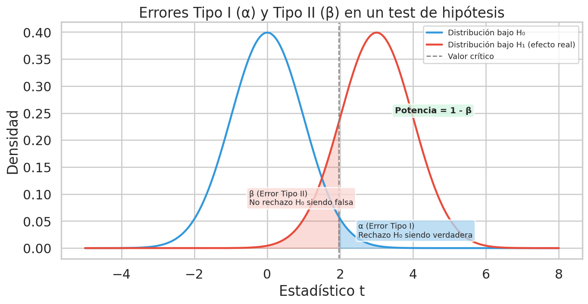
*Fig. 4.1 — Curva azul: distribución bajo H₀. Curva roja: distribución bajo H₁ (efecto real). El área azul a la derecha del valor crítico es α (Error Tipo I). El área roja a la izquierda es β (Error Tipo II). La potencia (1-β) es el área roja a la derecha del valor crítico.*

**Tabla resumen:**

|  | H₀ verdadera | H₀ falsa |
|--|:----------:|:--------:|
| **No rechazar H₀** | ✅ Decisión correcta (1-α) | ❌ Error Tipo II (β) |
| **Rechazar H₀** | ❌ Error Tipo I (α) | ✅ Decisión correcta (potencia = 1-β) |

### 4.4 Tamaño del efecto (effect size)

El **effect size** (d de Cohen) estandariza la diferencia entre grupos, independientemente de las unidades:

$$d = \frac{\bar{X}_A - \bar{X}_B}{s_{pooled}}$$

| d | Interpretación |
|---|---------------|
| 0.2 | Efecto pequeño |
| 0.5 | Efecto mediano |
| 0.8 | Efecto grande |

**¿Por qué importa?** Porque con una muestra suficientemente grande, **cualquier diferencia** (por mínima que sea) puede resultar "estadísticamente significativa". El effect size dice si la diferencia es **prácticamente relevante**.

### 4.5 Tamaño de muestra necesario

Antes de recolectar datos, se debería calcular el **n mínimo** para detectar un efecto de cierto tamaño con una potencia deseada.

**En Python:**
```python
from statsmodels.stats.power import tt_ind_solve_power

n_needed = tt_ind_solve_power(
    effect_size=d,      # tamaño del efecto esperado
    alpha=0.05,         # nivel de significancia
    power=0.80,         # potencia deseada
    ratio=n_B/n_A       # relación entre tamaños de grupo
)
```

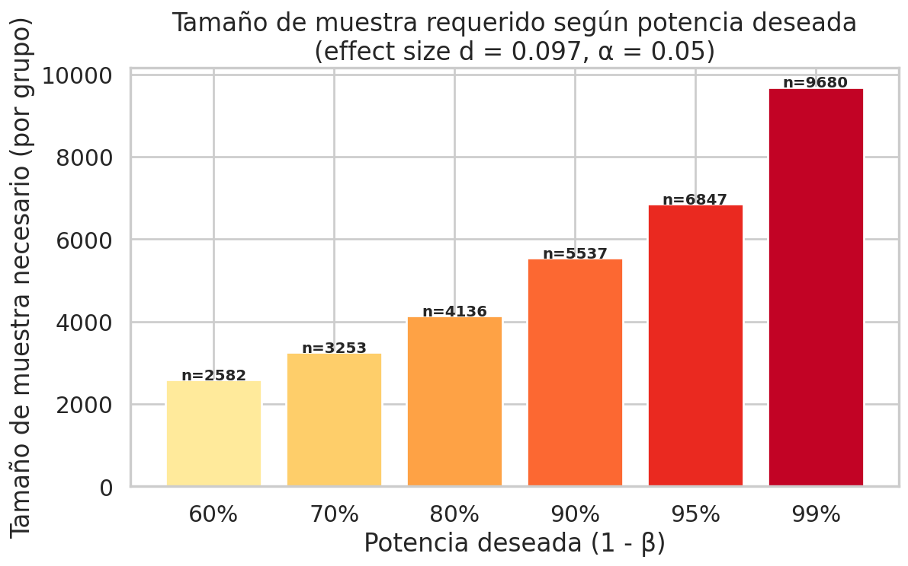
*Fig. 4.2 — Tamaño de muestra necesario (por grupo) para alcanzar distintos niveles de potencia, dado el effect size observado en los datos. A mayor potencia deseada, se necesitan más observaciones.*

---

## 5. Comunicación y visualización de resultados

📘 *Filmina: clase 4 — Visualización y Comunicación.*

El **Ejercicio 3** pide comunicar un resultado del análisis adaptado a una audiencia específica.

### 5.1 Principios de comunicación efectiva

La filmina distingue dos usos distintos de la visualización:

- **Exploración** (visualizaciones *para nosotros*): buscar patrones, entender los datos, iterar hipótesis. Puede ser densa, imperfecta, sobrecargada.
- **Presentación** (visualizaciones *para otros*): comunicar una conclusión ya formada a una audiencia. Debe ser limpia, dirigida, y priorizar el mensaje.

**Principios para presentación:**

1. **Un mensaje central:** ¿cuál es la conclusión más importante? Reducirla a una oración.
2. **Reducir el ruido:** eliminar todo lo que no aporte al mensaje.
3. **Jerarquía visual:** lo más importante se ve primero.
4. **Contexto necesario:** el receptor debe entender sin leer todo el informe.

> **📘 Cita de la filmina:** *"The way we represent a thing affects the way we reason about a thing"* — la forma en que representamos algo afecta cómo razonamos sobre ese algo.

**Características de una buena visualización (Alberto Cairo, citado en la filmina):**

| Característica | Significado |
|---|---|
| **Honesta** | Representa datos correctos sin distorsionarlos |
| **Funcional** | Permite que los datos se interpreten adecuadamente |
| **Estética** | Diseño cuidado, atrae sin distraer |
| **Esclarecedora** | Muestra patrones que de otro modo no serían visibles |
| **Informativa** | Aporta más información que la suma de sus partes |

### 5.2 Sesgos cognitivos del observador

📘 *Filmina: clase 4 — Visualización y Comunicación.*

Al diseñar visualizaciones, el creador debe ser consciente de que el cerebro del lector aplica **atajos cognitivos** que pueden generar conclusiones erróneas. La filmina identifica tres sesgos principales:

| Sesgo | Definición | Ejemplo |
|---|---|---|
| **Patternicity bug** | Tendencia a encontrar patrones en cualquier conjunto de objetos, incluso cuando no los hay | "La cara en Marte" — el cerebro completa una cara sobre una roca al azar |
| **Storytelling bug** | Tendencia a construir narrativas causales que expliquen los patrones percibidos | "Los programadores de Go ganan más porque Go es más difícil" cuando la realidad puede ser un confusor de seniority |
| **Confirmation bug** | Tendencia a aceptar más fácilmente la información que refuerza creencias previas | Un lector convencido de que "en IT las mujeres ganan lo mismo que los hombres" no va a procesar igual un gráfico que muestra una brecha que uno que la contradiga |

**Consecuencia para el diseño:** una visualización honesta debe **resistir activamente** estos sesgos del lector. Por ejemplo, si una correlación podría interpretarse causalmente, agregar explícitamente una nota recordando que *"correlación ≠ causalidad"* (la filmina cita a [Tyler Vigen, Spurious Correlations](https://tylervigen.com/spurious-correlations) como referencia canónica).

### 5.3 Ranking de encodings visuales (Cleveland-McGill)

📘 *Filmina: clase 4 — Visualización y Comunicación, basado en Cleveland y McGill (1984).*

No todos los encodings visuales tienen la misma efectividad para que el lector **estime correctamente** una cantidad. Cleveland y McGill ordenaron los encodings según el error que un observador comete al intentar comparar cantidades:

| Puesto | Encoding | Error |
|:--:|---|---|
| **1** | Posición en una escala común (ej. ejes X/Y) | Menor error |
| 2 | Posición en escalas no alineadas | |
| 3 | Largo (ej. barras) | |
| 4 | Ángulo e inclinación (empate) | |
| 5 | Área (ej. círculos de distinto tamaño) | |
| 6 | Volumen, densidad, saturación de color (empate) | |
| **7** | Tonalidad cromática (rojo vs azul) | Mayor error |

**Consecuencia práctica:**

- Para comparaciones precisas, usar **posición** (scatter, bar chart con eje común). Es el encoding más confiable.
- Los **pie charts** usan ángulo (puesto 4) y además requieren que el lector compare arcos entre sí — de ahí el famoso *"the horror of pie charts"* de la filmina. Solo son aceptables con pocas categorías (< 5) y diferencias grandes.
- Los **gráficos 3D** son trampas habituales: el volumen (puesto 6) es de los peores encodings y además introduce distorsión de perspectiva.
- El **color** (tonalidad) es el peor encoding para comparación cuantitativa — usarlo para **categoría**, no para magnitud.

### 5.4 Elegir la visualización adecuada

| Querés mostrar... | Usá... | NO usés... |
|-------------------|--------|-----------|
| Comparación entre 2 grupos | Barras, boxplot | Pie chart |
| Distribución | Histograma, KDE | Tabla de números |
| Tendencia temporal | Líneas | Barras |
| Proporción de un todo | Pie chart (max 5 categorías) | Pie chart con 15 categorías |
| Relación entre 2 variables | Scatterplot | Tabla |

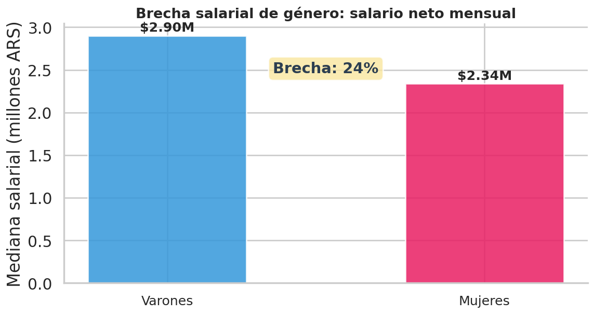
*Fig. 5.1 — Ejemplo de visualización limpia para comunicar la brecha salarial. Usa solo dos barras, colores intuitivos, valores numéricos visibles y un dato resumen destacado. El mensaje se entiende en segundos.*

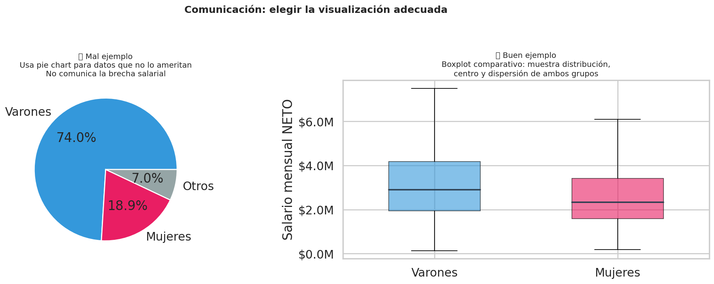
*Fig. 5.2 — Izquierda: un pie chart que no comunica la brecha salarial (mala elección). Derecha: un boxplot comparativo que muestra distribución, centro y dispersión de ambos grupos (buena elección). La visualización correcta depende del mensaje.*

### 5.5 Principio de Tufte (proporción tinta/datos)

📘 *Filmina: clase 4 — Visualización y Comunicación, citando a Edward Tufte.*

Edward Tufte propuso un principio de diseño fundamental: **maximizar la proporción "tinta/datos"**. Esto significa que cada elemento visual del gráfico debe contribuir a la comunicación del dato, y todo lo que no aporta debe eliminarse. La filmina lo resume en 5 reglas:

1. **La prioridad es mostrar los datos** — no decorar, no impresionar estéticamente.
2. **Maximizar la proporción datos/tinta** — toda la tinta debe usarse para transmitir información.
3. **Eliminar la tinta no destinada a datos** — grillas densas, bordes, sombras, 3D gratuito.
4. **Eliminar la tinta redundante** — no repetir la misma información con encodings distintos sin razón.
5. **Revisar y editar** — iterar el diseño como se itera un texto.

El término *"chartjunk"* (basura visual) lo acuñó Tufte para referirse a todos los adornos innecesarios que saturan los gráficos de Excel por defecto: fondos con gradiente, efectos de sombra, bordes gruesos, leyendas redundantes, etc.

**Consecuencia práctica para el entregable:**

- Los gráficos del informe del entregable (tanto parte 1 como parte 2) **deben preferir lo limpio sobre lo recargado**.
- Fondo blanco o gris muy claro, ejes finos, grilla discreta, tipografía legible.
- Color como **portador de categoría** (no de decoración), y solo cuando aporta información.
- Evitar leyendas flotantes, sombras, gradientes, 3D, pie charts con más de 5 categorías.

### 5.6 Adaptar al público objetivo

| Audiencia | Nivel técnico | Énfasis en... |
|-----------|:------------:|---------------|
| Artículo de difusión | Bajo | Simpleza, impacto social, lenguaje accesible |
| Publicación científica | Alto | Rigor, significancia, limitaciones, metodología |
| Tweet / LinkedIn | Muy bajo | Un solo dato impactante, visual en segundos |

### 5.7 Las tres audiencias del entregable

**Opción 1 — Artículo de difusión (ONG):**
- Lenguaje simple, sin jerga estadística.
- Un gráfico limpio con colores significativos.
- Una oración de énfasis tipo: "Las mujeres en tecnología ganan un X% menos que los varones."
- No más de 1 página A4.

**Opción 2 — Publicación científica:**
- Incluir p-valor, intervalo de confianza, effect size.
- Justificar la validez: supuestos del test, potencia, limitaciones.
- Puede ser más denso y complejo.
- No más de 1 página A4.

**Opción 3 — Tweet / LinkedIn:**
- Un número impactante o un gráfico que se entienda en 3 segundos.
- Ejemplo: "En Argentina, los programadores varones ganan un X% más que las programadoras. Fuente: Sysarmy 2026."
- Aparte, una breve descripción de metodología (no en el tweet, sino adjunta).

---

## 6. Mapa de conceptos por ejercicio

| Concepto | Ej.1 (Estimación) | Ej.2 (Test) | Ej.3 (Comunicación) |
|----------|:--:|:--:|:--:|
| Parámetro vs estimador | ✅ | | |
| Error estándar | ✅ | ✅ | |
| Estimación puntual | ✅ | | |
| Intervalo de confianza | ✅ | | |
| IC para diferencia de medias | ✅ | | |
| Relación IC ↔ test | ✅ | ✅ | |
| Hipótesis nula y alternativa | | ✅ | |
| Estadístico de prueba (t) | | ✅ | |
| Distribución bajo H₀ | | ✅ | |
| P-valor | | ✅ | ✅ |
| Test de Welch | | ✅ | |
| **Mann-Whitney U** *(no paramétrico, 2 grupos)* | | ✅ *(2.2 robustez)* | |
| **ANOVA de un factor** *(k > 2 grupos)* | | ✅ *(2.4 extensión)* | |
| **Kruskal-Wallis** *(no paramétrico, k > 2)* | | ✅ *(2.4 extensión)* | |
| Tests omnibus vs post-hoc | | ✅ *(2.4)* | |
| Error Tipo I (α) | | ✅ | |
| Error Tipo II (β) | | ✅ | |
| Potencia (1-β) | | ✅ | |
| Effect size (d de Cohen) | | ✅ | ✅ |
| Tamaño de muestra necesario | | ✅ | |
| Principios de comunicación | | | ✅ |
| Elección de visualización | | | ✅ |
| Adaptación al público | | | ✅ |
| Sesgos cognitivos del observador | | | ✅ |
| Ranking de encodings (Cleveland-McGill) | | | ✅ |
| Principio de Tufte (tinta/datos) | | | ✅ |
| Test Chi² de independencia | | ✅ | |
| Z-test para proporciones | | ✅ | |
| IC para varianza (Chi²) | ✅ | | |
| Método del pivote | ✅ | ✅ | |

---

## 7. Lecturas recomendadas

### 📘 Filminas del curso (prioridad máxima)

Las 4 filminas de las clases 3 y 4 están mirrorizadas localmente en [`_site/filminas/`](../../../_site/filminas/). Se recomienda leerlas en este orden antes y durante la resolución del entregable:

| # | Filmina | Archivo local | Enfoque |
|:--:|---|---|---|
| 1 | Estadísticos y Estadística | [`clase3_estadisticos_y_estadistica.pdf`](../../../_site/filminas/clase3_estadisticos_y_estadistica.pdf) | Muestreo, LGN, TCL — fundamentos para entender todo lo que sigue |
| 2 | Estimación | [`clase3_estimacion.pdf`](../../../_site/filminas/clase3_estimacion.pdf) | Estimadores, IC, método del pivote — base para el ejercicio 1 |
| 3 | Test de Hipótesis | [`clase4_test_de_hipotesis.pdf`](../../../_site/filminas/clase4_test_de_hipotesis.pdf) | Tests, errores, Welch, Chi² — base para el ejercicio 2 |
| 4 | Visualización y Comunicación | [`clase4_visualizacion_y_comunicacion.pdf`](../../../_site/filminas/clase4_visualizacion_y_comunicacion.pdf) | Encodings, Tufte, sesgos, audiencias — base para el ejercicio 3 |

También disponibles en formato texto (`.txt`) en el mismo directorio, útiles para búsqueda rápida por palabras clave.

### 📓 Notebooks del curso

Las notebooks del curso están en [`AnalisisyVisualizacion/notebooks/`](../../../AnalisisyVisualizacion/notebooks/):

- **`04_Estadisticos.ipynb`** — demo práctica de los conceptos de la filmina "Estadísticos y Estadística"
- **`05_Test_de_Hipotesis.ipynb`** — demo práctica de los tests de hipótesis, incluyendo t de Student, Welch, Chi², ANOVA y Kruskal-Wallis (estos dos últimos agregados por el docente el 13/04/2026 como complemento para el caso de k > 2 grupos)

### 📚 Bibliografía citada en las filminas

- **Tufte, E.** — *"The Visual Display of Quantitative Information"* — principio de la proporción tinta/datos, crítica al chartjunk
- **Huff, D. (1954)** — *"How to Lie with Statistics"* — clásico sobre manipulaciones visuales y estadísticas (citado literalmente en la filmina de visualización)
- **Cairo, A.** — *"The Truthful Art: Data, Charts, and Maps for Communication"* — características de una visualización honesta y funcional
- **Cleveland, W. S., & McGill, R. (1984)** — *"Graphical Perception: Theory, Experimentation, and Application..."* — estudio fundamental del ranking de encodings visuales
- **Nussbaumer Knaflic, C.** — *"Storytelling with Data"* — comunicación de resultados para distintas audiencias
- **Tyler Vigen** — [Spurious Correlations](https://tylervigen.com/spurious-correlations) — colección canónica de correlaciones absurdas, útil para recordar que correlación ≠ causalidad
